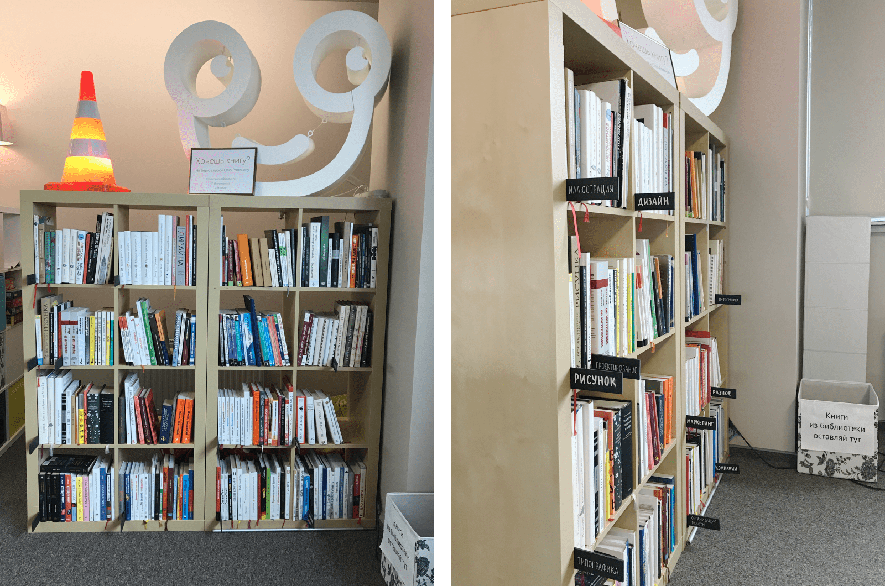
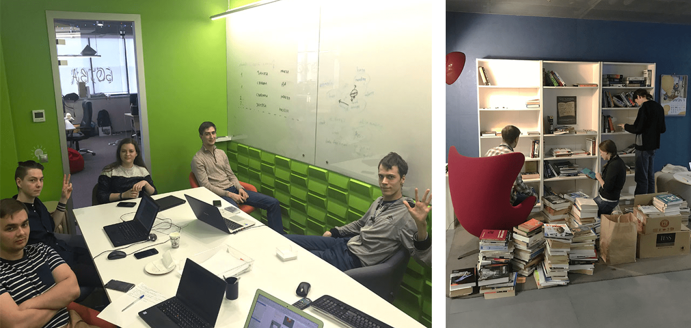
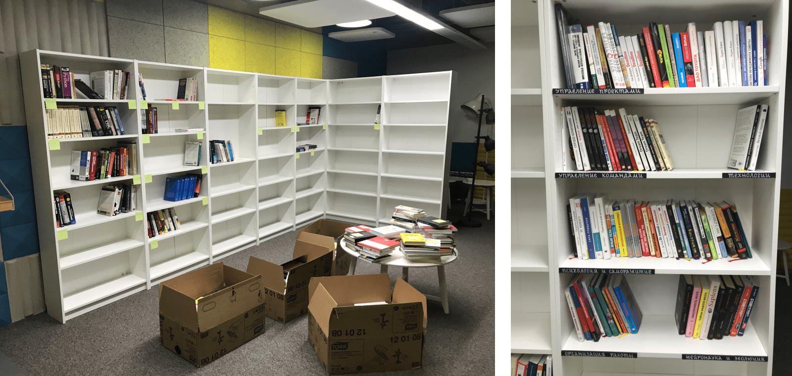
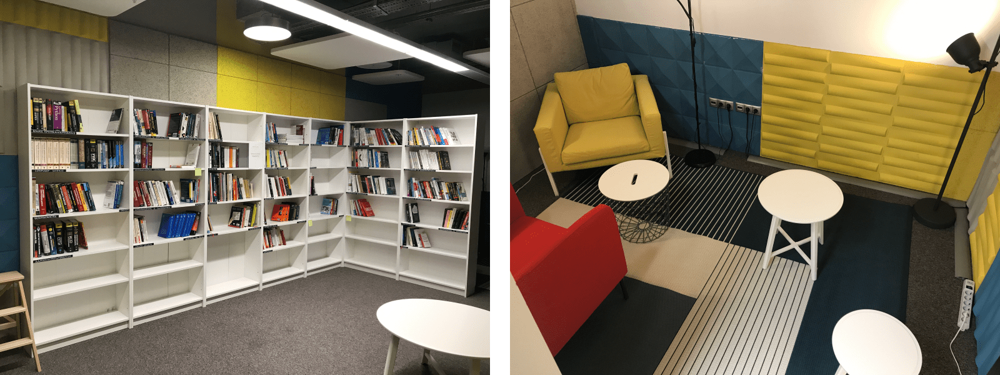
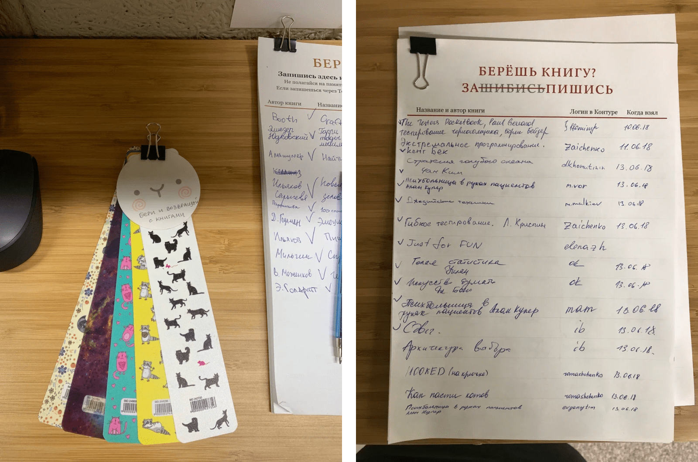
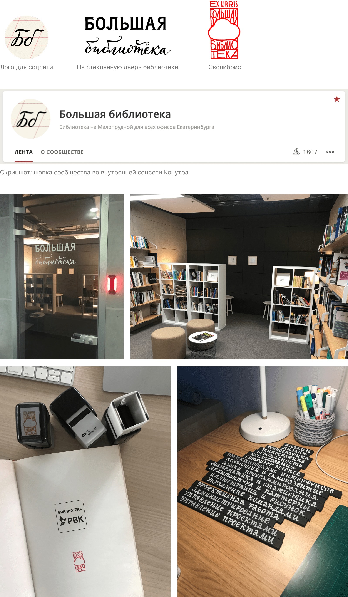
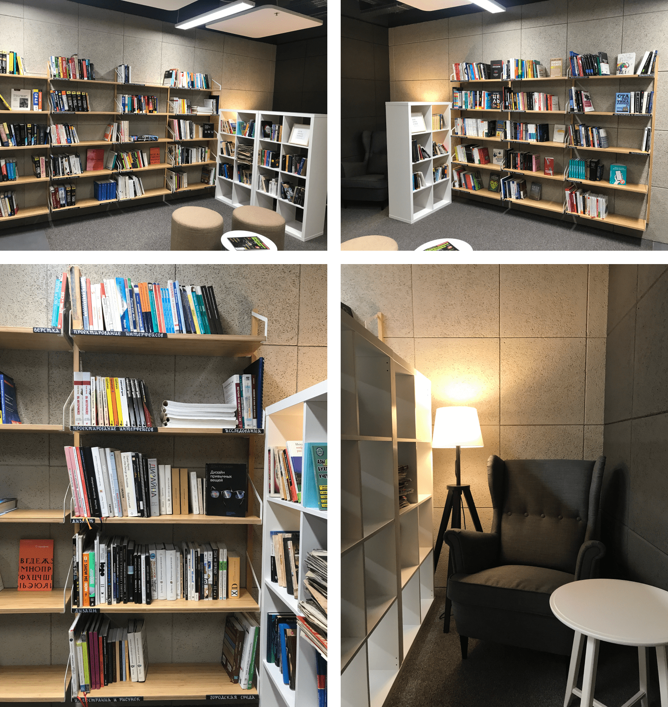
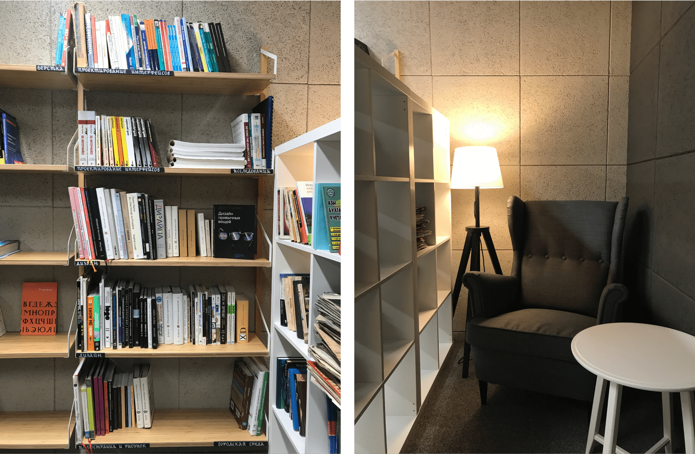
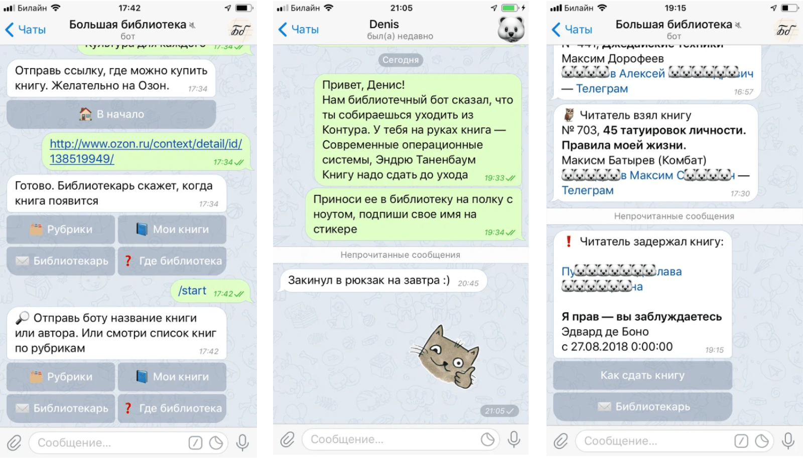
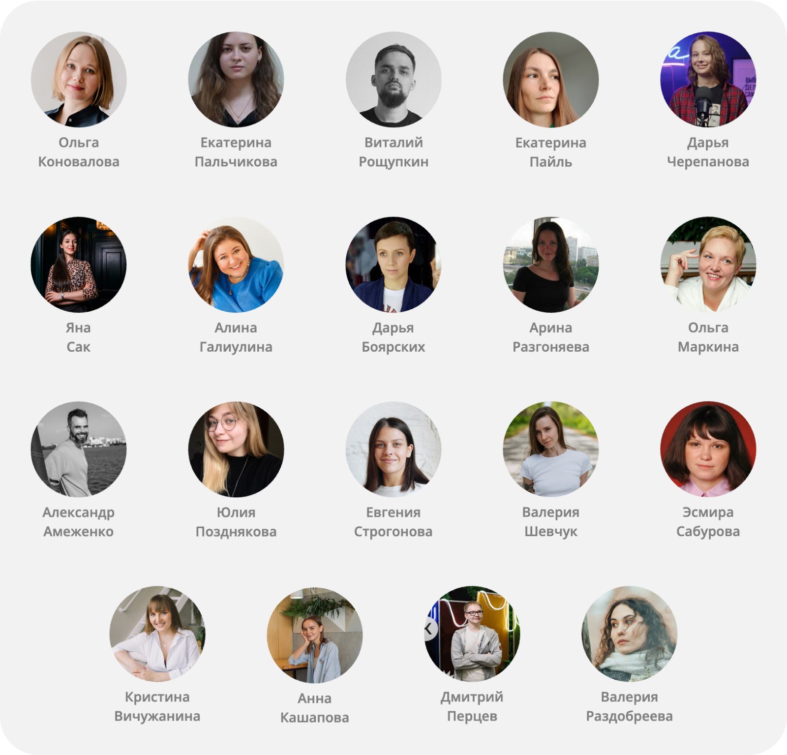

# Большая библиотека
## Начало
Эта история началась в 2017 году в СКБ Контуре.

Раньше в разных отделах Контура были свои небольшие библиотеки: у разработчиков, тестировщиков, аналитиков и дизайнеров. В каждой библиотеке были свои библиотекари и свои правила. Я дизайнер, и однажды ко мне пришел мой руководитель и предложил стать библиотекарем. Была задача оживить библиотеку дизайнеров: найти книгам удобное место, куда можно приходить и выбирать их, чаще закупать новые, следить, чтобы книги не зависали на руках у должников, сделать библиотеку интересной.

Я с удовольствием взялась за дело. Нашла книгам уютный уголок, прибралась там, создала рубрикацию — теперь было легко найти нужную книгу. В онлайне книги можно было поискать в гуглотаблице: посмотреть свободна ли книга, встать в очередь, если занята, посмотреть, у кого она на руках. Я запустила новостные рассылки для дизайнеров о том, что происходит в библиотеке. Эти рассылки были с милым дизайном и написаны неформальным дружелюбным языком. Дизайнерам они очень нравились.

## Объединение
После всех изменений библиотека дизайнеров стала популярной не только среди дизайнеров. Ребята из других отделов тоже хотели брать книги из дизайн-библиотеки. И тут я столкнулась с бюрократическими моментами. Книги для дизайнеров покупались из бюджета отдела дизайна. Мы не могли закупать такое количество книг, чтобы их могли читать все отделы. У меня возникла мысль объединить книги всех отделов в одну большую библиотеку.

Я договорилась об общем бюджете с руководством. Договорилась с библиотекарями других отделов о том, чтобы соединить все книги в едином пространстве. Нашла комнату для будущей библиотеки и заказала мебель. Мы обустроили уютный уголок с креслами и торшерами для чтения. В этом уголке есть стена с автографами авторов книг, которые есть у нас в библиотеке. Я продумала все процессы.

25 апреля 2018 года Большая библиотека Контура открыла свои двери для первых читателей.

## Процессы
Читатели могли попросить купить в библиотеку новую книгу — мы покупали. На покупку книг было лишь одно условие: книги должны помогать развиваться профессионально. Поэтому книги по психологии, управлению временем, проектами, людьми мы покупали, а книги по йоге, здоровому питанию, и эзотерике нет.

Читатели возвращаются в библиотеку только в том случае, если знают, что они получат желаемую книгу. Поэтому я уделяла большое внимание настройке процессов. Было важно, чтобы читатель мог получить книгу в какой‑то разумный и предсказуемый срок. Нужно было, чтобы книги не терялись, не зависали на руках у должников. Если мы видели, что за книгой большие очереди, мы докупали дополнительные экземпляры. Мы напоминали должникам о том, что пора сдать книгу. Мы устраивали инвентаризации и разыскивали пропавшие книги. За кулисами Большой библиотеки спрятана очень большая работа, невидимая читателям.

Но даже этого нам показалось мало. В библиотеку вложено большое количество человеческой заботы. В комнате понятные объявления — куда сдавать, как взять книги. У библиотеки есть сообщество во внутренней соцсети Контура, где мы пишем о новинках и других интересных вещах. Как‑то мы купили закладочек, чтобы читатели ими пользовались и возвращали с книгами. Одна из библиотекарей привнесла практику «книги недели» — какая‑то из книг рубрики разворачивалась лицом к читателю, чтобы быть более заметной на полке. Буккроссинг на отдельных полках тоже был — без правил, можно брать что хочешь и оставлять.

А еще я нарисовала экслибрис, и мы заказали с ним штампы. Впрочем рисовала я не только его. Таблички для рубрик, название на дверь библиотеки, лого для бота и соцсети.

Шло время, библиотека развивалась. Мы сделали ремонт — стало еще уютнее.

## Бот в Телеграме
У нас появился бот в Телеграме. С его помощью можно искать книги поиском или по рубрикам, записывать на себя книгу, вставать в очередь. Бот умеет напоминать должникам о том, что книгу надо сдать. После трех таких напоминаний читателю, если книга все еще не сдана, бот шлет сообщение библиотекарю, что нужно вмешаться. Бот очень помог избавиться от ручной работы библиотекарей. В режиме библиотекаря с его помощью можно делать, что душа пожелает: смотреть разную статистику, строить таблицы для инвентаризации — в построенной таблице только те книги, что есть сейчас на полках и их количество.

Когда какая‑то книга пропадала, мы устраивали поиски книги. В библиотеке есть камера, а мы благодаря нашим технологиям можем понять, в какой временной отрезок книга пропала. Так мы нашли много книг. Пропажа книги это не всегда злодеяние. Обычно читатель забывал записать на себя книгу или в чем‑то не разобрался.
## Другие офисы
Какое‑то время мы отправляли книги читателям в другие офисы Екатеринбурга. Но потом поняли, что это накладно для библиотекарей. Такие книги надо отдельно подписать, упаковать и отнести офис-менеджеру на отправку. Поэтому эту часть сценария мы урезали. Мы оставили возможность брать книги читателям из других офисов, но упаковку и отправку читатели организовывали сами — просили своих знакомых из нашего офиса. Стоит отметить, что пользоваться нашей библиотекой хотели даже читатели из офисов Контура в других городах :) Но тут мы сразу отказали. Слишком сложная логистика, слишком сложно возвращать книги с должников. Это повлияло бы на доступность книг для остальных читателей. Лучше уже сделать отличный сервис для довольно большой части пользователей, чем плохой для абсолютно всех.
## Библиотека живет и развивается
Блоггеры снимают свои видео в библиотеке, туда водят экскурсии, о библиотеке делают репортажи. Библиотека стала местом притяжения ❤️

Сейчас в библиотеке около 1400 книг и 2000 читателей. В ней трудятся уже другие библиотекари, чем те, кто был на старте. Перед своим декретом я полностью передала управление библиотекой ребятам, написала несколько инструкций по процессам. Ребята продолжают делать библиотеку классной и популярной в самом лучшем виде, она развивается и меняется.

Спасибо всем, кто принимал и принимает участие в создании и развитии библиотеки. Без вас у меня бы ничего не получилось. Я рада, что мне удалось зажечь искорки своей идеей и воплотить ее в жизнь в лучшем виде с вашей помощью. Это был потрясающий опыт.

Если вы хотите организовать библиотеку в своей компании и хотите пообщаться о библиотеке — пишите, с радостью поделюсь опытом и отвечу на вопросы.