# Каллиграфия и леттеринг
## Курсы Льва Либермана
Эта история началась в ноябре 2015 года, когда я откликнулась на твит Никиты пойти на курс каллиграфии для начинающих. Тогда я не знала, что Никита будет моим мужем, а каллиграфия и леттеринг станут одной из самых больших и интересных историй в моей жизни.

С Никитой мы сходили нанесколько разных курсов Льва по каллиграфии.
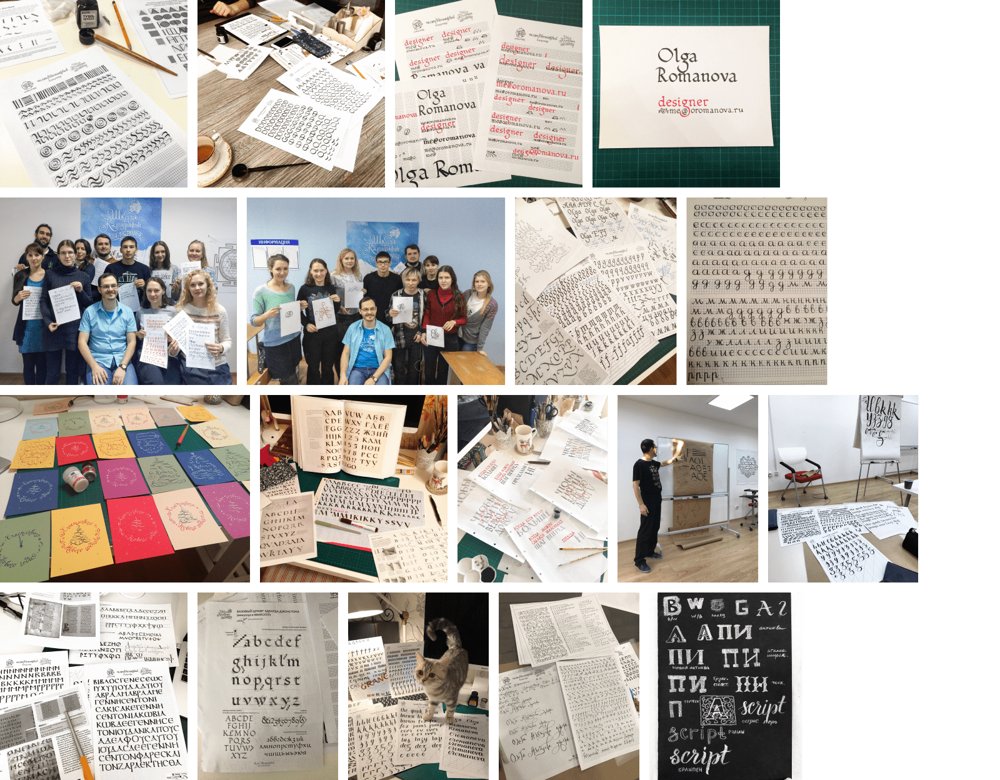
Когда мы изучали римский капитальный, то писали на больших форматах кистью. Было классно. Штрихи кистью просто обалденные.

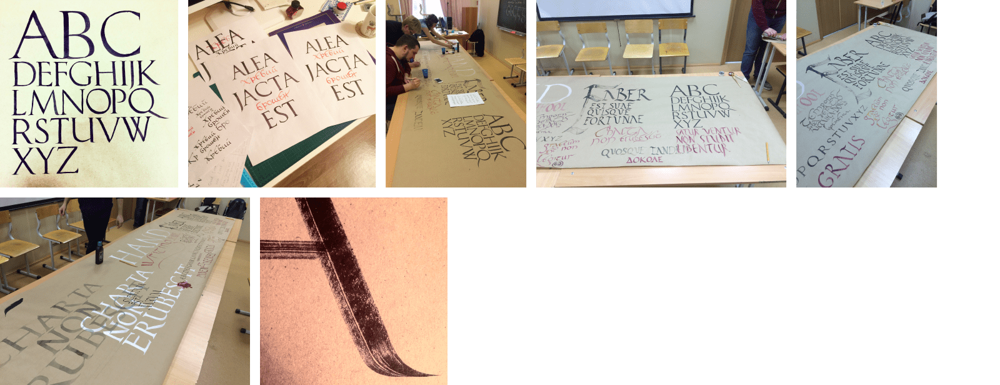
## Римские каникулы
А знаете, как интересно было ехать в отпуск в Рим и смотреть на все это письмо, которое мы проходили, своими глазами. И все это в камне с фиг знает каких времен.

Надо сказать, аккуратностью эти надписи не отличались :) Я понимаю, что работать с камнем сложно. Но набросок же можно нанести на камень сначала, чтобы строка таки влезла в ширину, и не пришлось в конце ужимать буквы. Ощущение, что им ваще было пофиг, как оно выглядит. Подписали там что-то и ладно. Ну, да, вылезло за рамку. Да и фиг с ним.
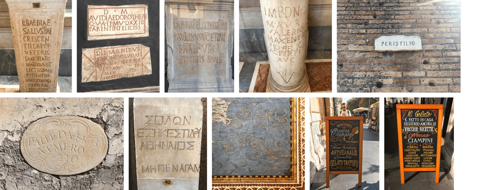
## Любимые работы
Как-то друзья попросили разрисовать чемодан. А папа мужа — сделать надпись на стену в мастерскую. И то, и другое — акриловые маркеры. На стене еще пыталась кистью и краской, но широким маркером оказалось в разы проще. Маркеры Molotow One4All — любовь навеки 🖤 🤍 🖤
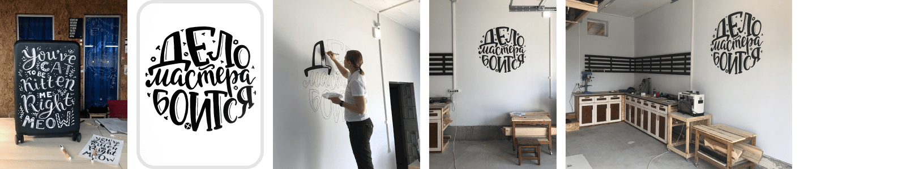
## Разное для Контура
Со временем мое хобби просочилось на работу. В офисе разработки Контура есть кафе, и его хозяин, Сережа, попросил нарисовать ему красивые досочки. Первые досочки не были особенными, просто аккуратными. Но постепенно я вошла во вкус, старалась придумывать что-то интересное.

Самый классный мел — Maped. Мягкий и не царапает. Лучшие меловые маркеры Uni Chalk. Они лучше ложатся, яркие и смываются неплохо.

С маркерами такая история, что многие очень плохо смываются с деревянной доски. В кафе была сезонная доска, которую обновляли каждый сезон. Доску каждый раз красили черным, чтобы старые надписи исчезли окончательно. Впрочем, следы от маркера остаются не только на доске. Дома у меня была стена, покрашенная специальной краской под мел. На ней тоже оставались следы после смывания.

Мел в свою очередь смывается хорошо. Но сыпется, смазывается. Если в планах нет стирать надписи с доски — маркеры идеальный вариант. Они ярче мела, не осыпаются. Надпись мелом желательно закреплять. Для этого можно распылять лак для волос. Только аккуратно и издалека. Если будет слишком мокро, мел смоется.
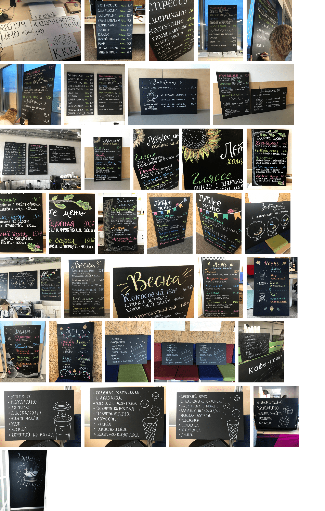
Когда я создавала Большую библиотеку Контура, мои навыки каллиграфии и леттеринга тоже пригодились. Я нарисовала:
надпись для стеклянной двери библиотеки — затем изготовили наклейку плоттерной резкой,
много табличек с названием рубрик — их крепили на полки с книгами,
экслибрис — с ним изготовили штампы и помечали экслибрисом все библиотечные книги,
аватарку для библиотечного сообщества во внутренней соцсети Контура.

[Всю историю библиотеки читайте в отдельной статье](http://olga-ko.com/big-library/).

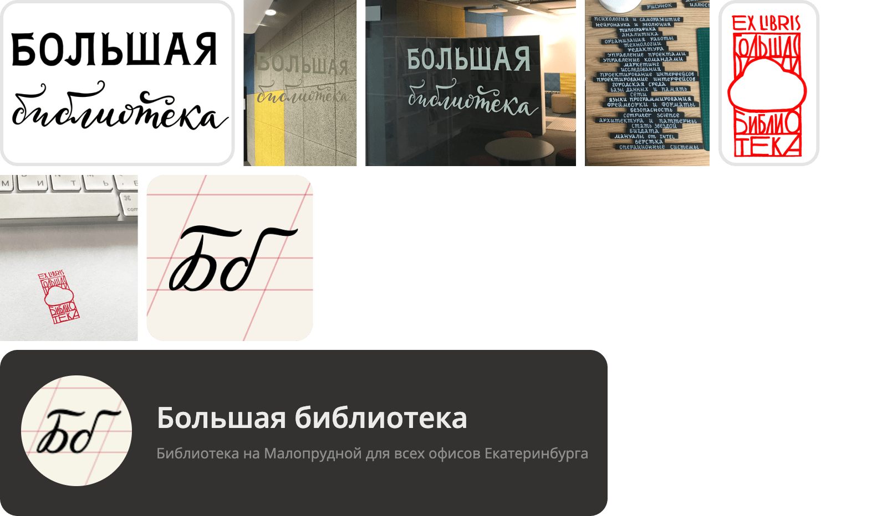
В Контуре у дизайнеров есть такая активность — на каждый новый месяц желающий дизайнер рисует календарь. Календари печатают, вешают в офисе, делают из календаря заставки на рабочий стол и на телефон. В 2017 году я писала февраль. На календаре стих Пастернака. Месяц написан колапеном, а сам стих пером. «Февраль. Достать чернил и плакать!..» Чернила я и правда достала, но плакала в феврале другого года.

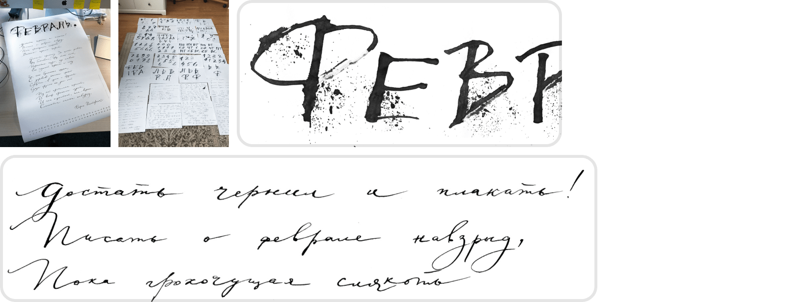
Разрисовывала шкафчики на кухнях офиса и нумеровала локеры на этажах.

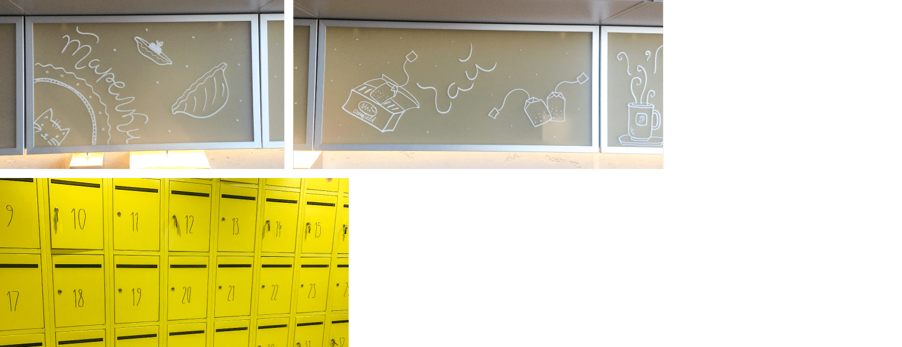
## Море букв
В свободное от курсов время я тоже писала буквы. Даже в кафе. Пока ждешь заказ, можно успеть повторить надпись на рекламке :) А где-то в кафе кладут крафтовую бумагу на весь стол — вот это был простор для рисования.

Один раз я сидела в Гринвиче в одном из магазинов и подписывала карточки. Их прицепляли к конфеткам и дарили людям. Акция какая-то была у них. Ручки тряслись, да еще стола нормального не было, приходилось сидеть бочком, ноги под этот якобы стол вообще не влезали. Но как-то справилась.

Ну и конечно, я подписывала открытки, подарочки. Делала слайды для презентаций, таблички для фотосессии.
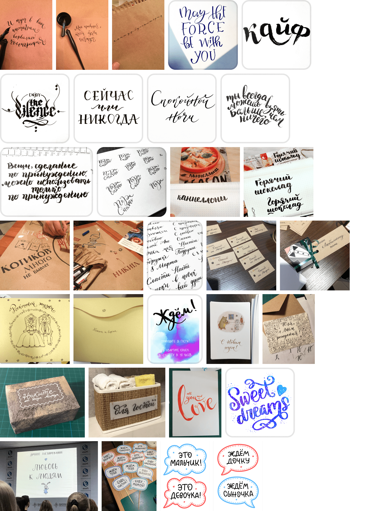
## Кража моего леттеринга
Напоследок расскажу историю, как у меня сперли леттеринг.

Как-то раз я училась векторному леттерингу. Написала маркером фразу «Детка, ты просто космос», отсканировала ее, а потом в Иллюстраторе обвела контур, частично изменив первоначальный вариант. Было это на заре моего увлечения каллиграфией, опыта было мало, надпись получилась таксебешная. Но я ее все равно выложила на Пинтерест, потому что выкладывала все, что пишу-рисую.
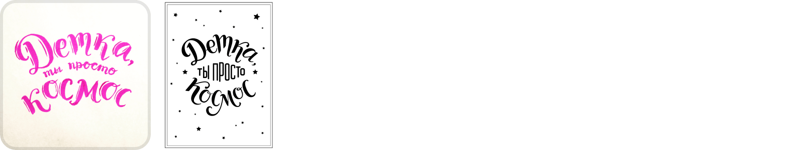
После этого мне как-то написала девушка с просьбой продать ей этот леттеринг. Она вручную делала мыло, и на нем делала надписи по шаблону. Не помню, о чем мы с ней договорились, но потом она пишет мне, что мою надпись уже кто-то там использует. Я офигела, написала этим ребятам, что это вообще-то моя работа, и я не давала разрешение ее использовать. В то время таких случаев было несколько, я написала всем, кого нашла. Ничего правда не изменилось.

Спустя еще год-два или три я решила сделать поиск по картинке в гугле. И офигела повторно, сколько раз мою работу использовали. Товары с моей надписью продавались в Сима-ленде, на Вайлдберриз, на Озоне. Это были кружки, бокалы, футболки, блокноты, открытки, календари, брелки с гравировкой, копилки, сумки, наклейки, обложки на паспорт, фотоальбомы, часы, подушки, табуреты под ноги для туалета, медали — все, что душа пожелает. Люди не трудились даже убрать дурацкую рамочку вокруг этого добра и звездочки. Вот некоторые из них.
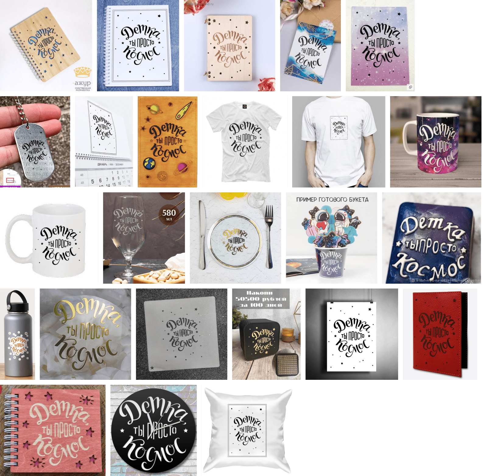
В разных цветах, твою мать.

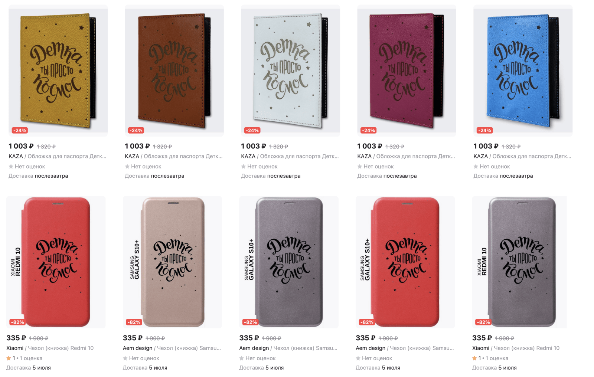
Отдельно обидно, что работа реально плохая. Сперли б хорошую.

Я хочу это развидеть 🤦🏼‍♀️

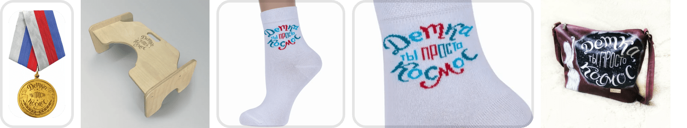
Если вы юрист, и хотите поучаствовать в добывании денег с этих всех людей — напишите мне. Поделюсь процентом от добычи.
## Стоки
Как-то я выложила свою работу, аналогичную той, что рисовала на чемонане, в один магазинчик. Никто ничего не купил, но она все еще там. Так что если хотите — велкам.
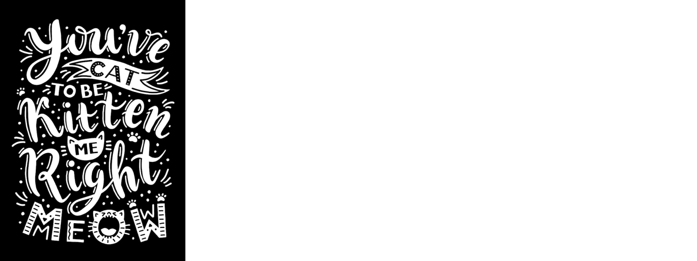