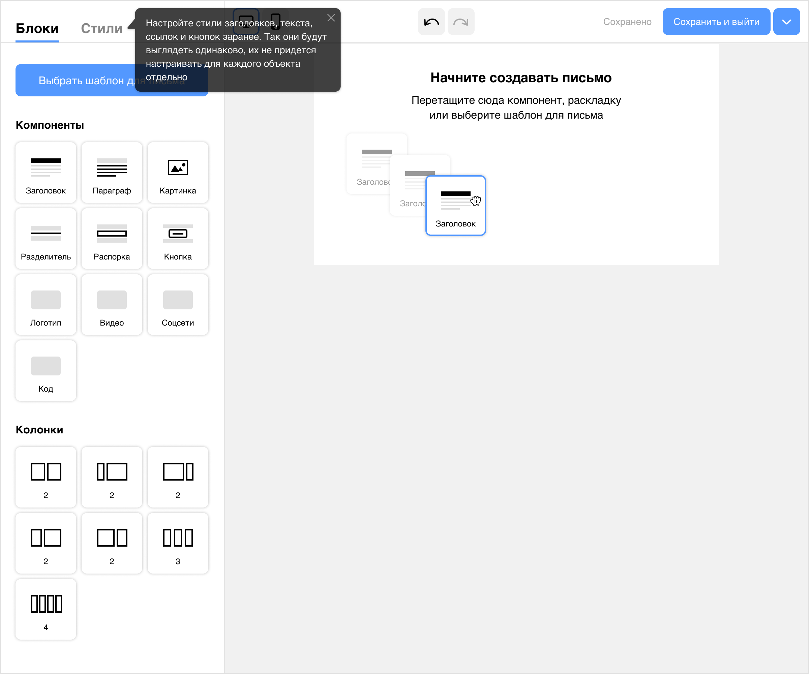
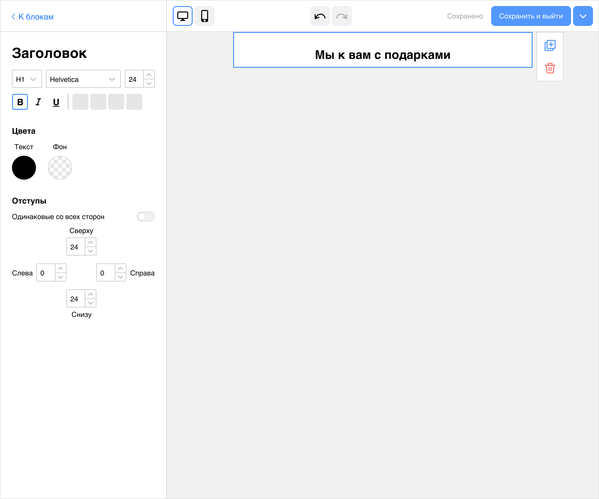
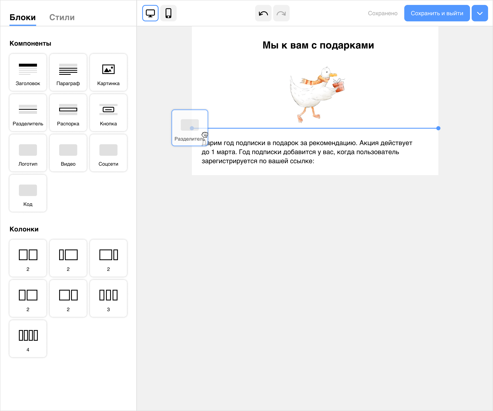
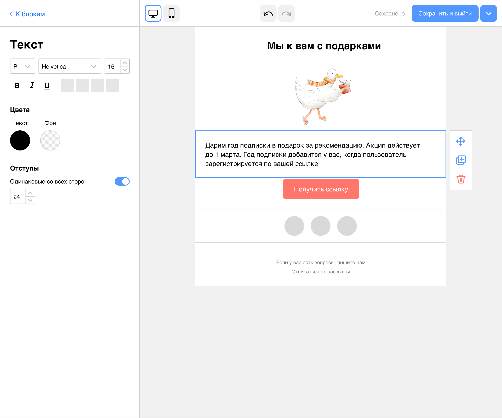
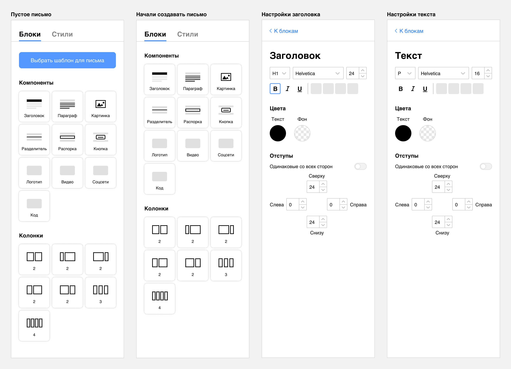
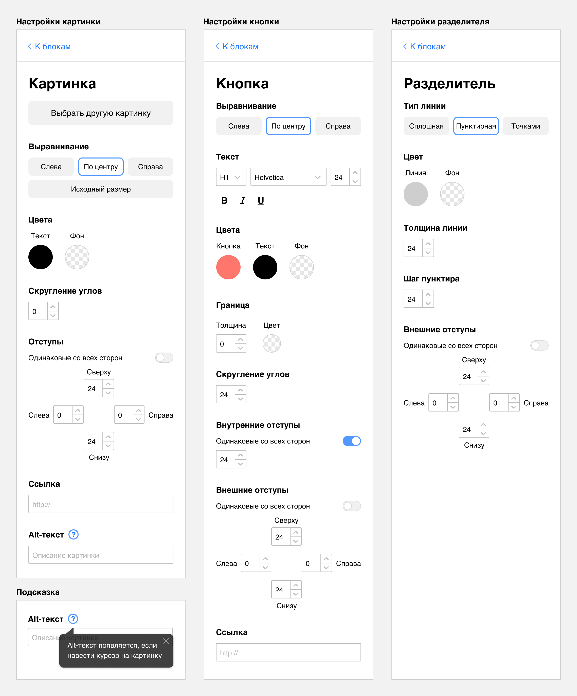
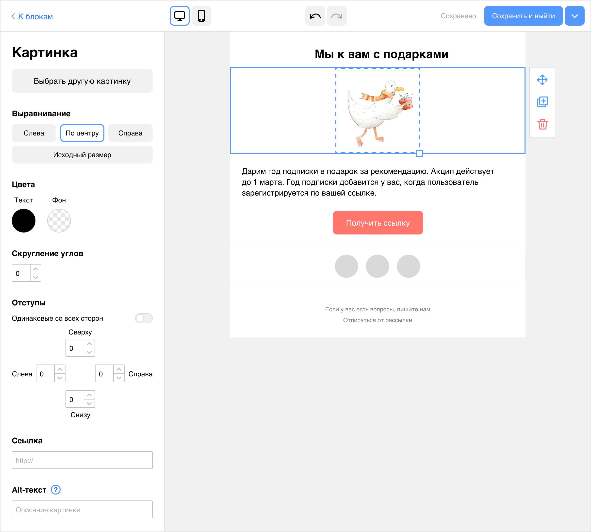
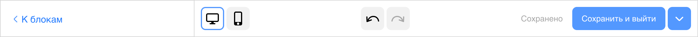

# Конструктор создания писем

Задача из тестового задания.

## Постановка задачи

В&nbsp;CRM-системе маркетологи создают кампании. Это могут быть SMS-рассылки, Push-уведомления или Email-рассылки. В&nbsp;задании предложено спроектировать страницу создания письма Email-рассылки для кампании. При создании кампании с&nbsp;почтовой рассылкой маркетологи не&nbsp;только собирают письмо, но&nbsp;еще заполняют дополнительные параметры самой кампании.

## Решение

### 1.&nbsp;Аналитика

#### Сценарий

Сценарий создания письма начинается на&nbsp;главной странице сервиса с&nbsp;создания кампании.

Если сценарий создания кампании основной у&nbsp;маркетологов&nbsp;&mdash; на&nbsp;главной должна быть заметная большая кнопка для этого.

Если основных сценариев несколько, на&nbsp;главной странице в&nbsp;зоне основного контента можно поместить большие плашки или кнопки для быстрых основных действий.

Если какие-то опции в&nbsp;создании кампании влияют на&nbsp;тип письма, их&nbsp;надо спросить на&nbsp;шаге, когда только начали создавать кампанию. Оставшиеся поля можно заполнить после создания письма. Самое ключевое, главное, долгое по&nbsp;времени&nbsp;&mdash; это создание самого письма, поэтому мы&nbsp;начинаем с&nbsp;него, а&nbsp;потом уже занимаемся заполнением дополнительных параметров.

#### Аналоги

Я&nbsp;посмотрела аналоги сервисов для создания писем. Самым удобным и&nbsp;понятным мне показался Mailchimp. Тем не&nbsp;менее какие-то изменения я&nbsp;все&nbsp;же внесла. Например, убрала возможность выбора шаблона, когда пользователь уже накидал блоков в&nbsp;письмо. Выбрать шаблон можно, пока экран пуст, есть кнопка. Она пропадает, когда пользователь начал собирать письмо из&nbsp;блоков. Не&nbsp;хочется, чтобы пользователь выбрал шаблон и&nbsp;уже собранное письмо пропало.

### 2.&nbsp;Проектирование

#### Подсказки

Для новичков я&nbsp;сделала пару подсказок, чтобы им&nbsp;было проще начать работу.

Первая подсказка&nbsp;&mdash; прямо на&nbsp;пустой странице. Она поясняет, что блоки из&nbsp;левой панели можно таскать. У&nbsp;Мэйлчимпа в&nbsp;новом письме уже есть блоки дефолтного письма, и&nbsp;их&nbsp;надо каждый раз удалять. Это кажется неудобным. Лучше уж&nbsp;научить пользователя таскать плиточки.

Вторая подсказка касается настроек стилей для блоков&nbsp;&mdash; если их&nbsp;настроить сразу, не&nbsp;нужно будет перенастраивать стили для однотипных объектов.

#### Настройка стилей для блоков

Тут мне не&nbsp;хватило информации, какая чаще бывает структура письма, как часто она требует настройки стилей. Может оказаться, что обычно в&nbsp;письме одна ссылка, одна кнопка и&nbsp;так далее, тогда особого смысла настраивать стили нет. Нужно больше информации по&nbsp;сценариям маркетологов. Если&nbsp;же настройка стилей в&nbsp;новом письме происходит очень часто, можно подумать про начало сценария создания письма со&nbsp;второй вкладки, &laquo;Стилей&raquo;, а&nbsp;не&nbsp;с&nbsp;&laquo;Блоков&raquo;.

В&nbsp;&laquo;Стилях&raquo; предполагаю настройку общей страницы письма: фон для письма и&nbsp;фон вокруг него, ширина блока с&nbsp;содержимым. Также настройки для основных объектов: заголовка, текста, кнопки, ссылки, загрузка логотипа. Еще я&nbsp;бы сделала дополнительное сохранение набора стилей. Например: это стили для рассылок одного проекта, а&nbsp;это для другого. Пользователь выбирает нужный набор стилей и&nbsp;идет собирать письмо.

#### Привычные  контролы

В&nbsp;настройках свойств объектов я&nbsp;использовала привычные нам контролы. С&nbsp;большей частью из&nbsp;них мы&nbsp;знакомы из&nbsp;документов Гугла, Ворда, других редакторов.

#### Расположение настроек блоков

Все настройки блоков в&nbsp;левой панели, их&nbsp;не&nbsp;надо искать в&nbsp;разных частях экрана. У&nbsp;Мэйлчимпа часть настроек текста вынесена в&nbsp;верхнюю панель, как в&nbsp;Гуглодоках, а&nbsp;часть в&nbsp;боковой панели. Мне кажеся это не&nbsp;очень удачным. Например, где должна быть настройка цвета текста? У&nbsp;Мэйлчимпа она вовсе не&nbsp;среди настроек шрифта, выравнивания, а&nbsp;в&nbsp;левой панели. Кажется, это не&nbsp;очевидно, пользователю придется каждый раз искать эту настройку в&nbsp;двух местах.

Собранное письмо можно сохранить как шаблон&nbsp;&mdash; около кнопки сохранения есть выпадашка с&nbsp;этим действием. Оно кажется не&nbsp;таким частотным, как общее сохранение и&nbsp;предпросмотр, поэтому спрятала в&nbsp;выпадашку.

#### Превью

Не&nbsp;стала делать отдельной кнопкой превью с&nbsp;открытием нового окна. Превью для десктопной версии уже показывается прямо тут. Поэтому сделала переключалку на&nbsp;мобильную версию&nbsp;&mdash; письмо уменьшится по&nbsp;ширине под мобильные, его можно будет продолжить редактировать в&nbsp;этом режиме.

#### Настройки для разных блоков

#### Блоки в&nbsp;режиме редактирования

#### Отрисовано не&nbsp;все

Я&nbsp;отрисовывала только часть иконок для этого задания для экономии времени. В&nbsp;плитках объектов и&nbsp;настройках текста вместо них серые прямоугольники.

### 3.&nbsp;Тестирования на&nbsp;пользователях

Я&nbsp;протестировала три статичных экрана на&nbsp;5&nbsp;пользователях. Вопросы пользователям были такие:

#### Экран&nbsp;1

1. Как начать создавать письмо?
2. Как настроить общие стили для всего письма?

#### Экран&nbsp;2

1. Как выбрать шрифт Arial и&nbsp;сделать цвет шрифта зеленым?
2. Как поменять очередность блоков?
3. Как удалить блок?
4. Как вернуться из&nbsp;редактирования блока к&nbsp;плиточкам с&nbsp;блоками, чтобы добавить новый блок?

#### Экран&nbsp;3

1. Как поменять картинку?
2. Как посмотреть превью письма для мобильной версии?
3. Как сохранить это письмо как шаблон?

#### Результаты тестирования

1. Двух первых человек смутили стрелки отмены действий (экран&nbsp;2, вопрос 4). Они смотрели на&nbsp;стрелки и&nbsp;на&nbsp;ссылку в&nbsp;левой панели, которая в&nbsp;первых версиях называлась &laquo;Готово&raquo;:  Слова &laquo;Готово&raquo; или &laquo;Сохранить&raquo; воспринимаются как финальные действия в&nbsp;редакторе письма. Я&nbsp;поменяла вид стрелок отмены и&nbsp;название ссылки&nbsp;&mdash; &laquo;К&nbsp;блокам. А&nbsp;также перенесла стрелки в&nbsp;центр панели. Вариант &laquo;К&nbsp;блокам&raquo; и&nbsp;новые стрелки больше не&nbsp;путали людей. 
2. Один человек не понял, что означает раздел «Раскладка» в «Блоках», переименовала его в «Колонки»: 
3. Один человек не&nbsp;понял, как менять блоки местами. Есть пользователи, которые не&nbsp;встречали такой элемент управления. Но&nbsp;большинство с&nbsp;ним знакомо. Можно добавить одноразовую подсказку в&nbsp;момент первого появления правой панельки с&nbsp;действиями.  
