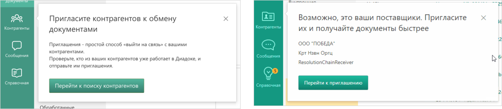
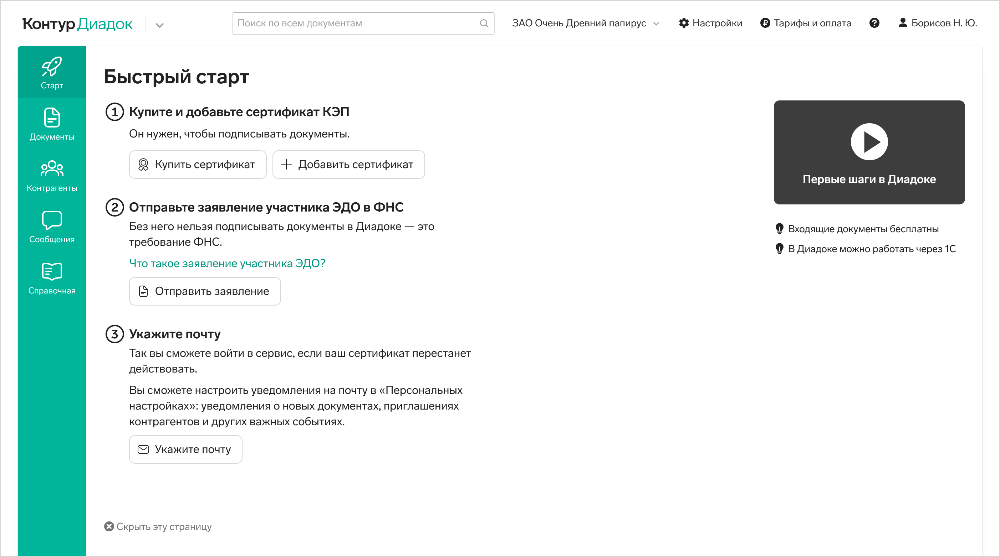
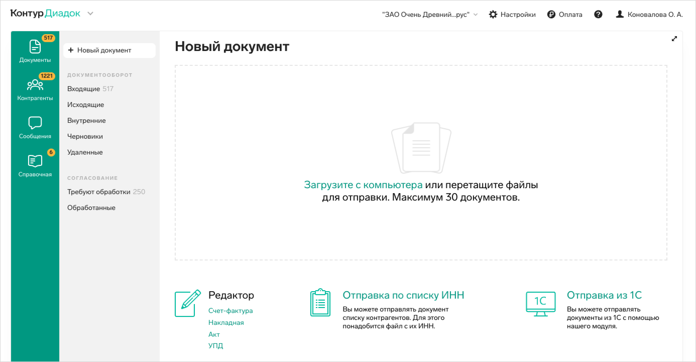
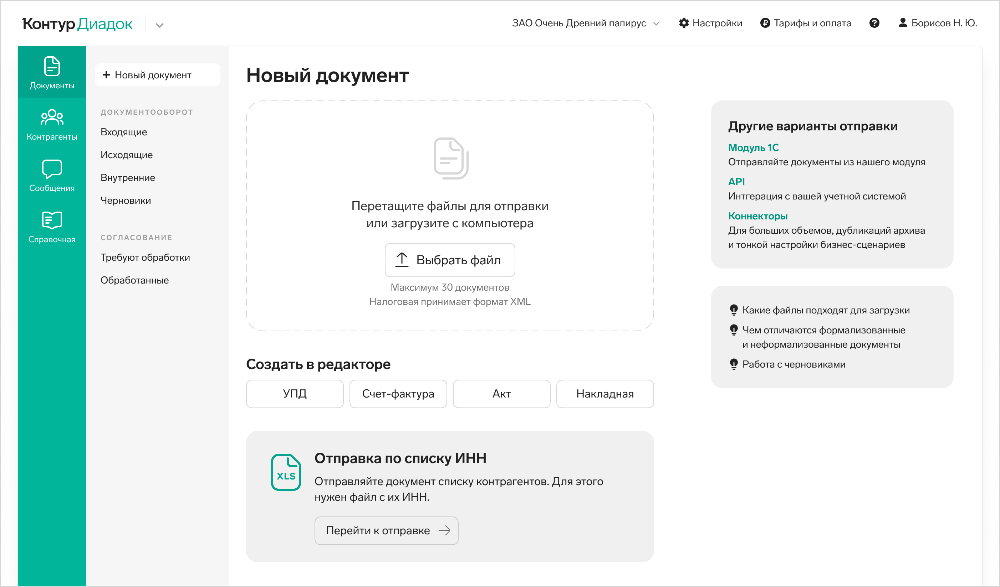

# Онбординг в Диадоке

## Цель онбординга

Целью онбординга было максимально быстро довести пользователя до&nbsp;совершения целевого действия. Если пользователь дойдет до&nbsp;целевого действия быстро, он&nbsp;быстрее сможет принять решение о&nbsp;продолжении работы в&nbsp;сервисе. А&nbsp;по&nbsp;пути пользователь поймет, что работать в&nbsp;сервисе легко.

## Наследие прошлого

Нашей цели мешала пара вещей.

Старые лайтбоксы, которые появлялись в&nbsp;сервисе друг за&nbsp;другом и&nbsp;были слишком навязчивыми. Пользователи закрывали&nbsp;их, не&nbsp;читая.

Эти&nbsp;лайтбоксы предлагали: <ul> <li>Выпустить сертификат для работы.</li> <li>Отправить заявление участника ЭДО.</li> <li>Оставить почту для того, чтобы мы&nbsp;могли слать рассылки.</li> <li>Посмотреть видео о&nbsp;сервисе и&nbsp;почитать справочные статьи.</li> </ul>

Кроме лайтбоксов в&nbsp;сервисе непредсказуемо могли появляться тултипы, которые назывались старым онбордиингом. Они не&nbsp;вели к&nbsp;целевому действию, скорее довольно хаотично давали какие-то советы.

## Решения

### Страница &laquo;Быстрый старт&raquo;

Я&nbsp;проанализировала информацию, которую мы&nbsp;пытались получить у&nbsp;пользователя на&nbsp;старте с&nbsp;помощью лайтбоксов. В&nbsp;основном это были важные вещи, без которых не&nbsp;начать работу&nbsp;&mdash; без выпуска сертификата электронной подписи и&nbsp;отправки заявления участника ЭДО нельзя подписывать и&nbsp;отправлять документы в&nbsp;Диадоке.

Менее важная для пользователя вещь, но&nbsp;важная для нас&nbsp;&mdash; подтверждение почты. Например, мы&nbsp;шлем пользователям письма об&nbsp;изменениях в&nbsp;законодательстве.

Справочные статьи и обучающие видео могут быть полезны для пользователя, но&nbsp;без них вполне можно начать работу в&nbsp;сервисе.

Все это я&nbsp;учла на&nbsp;странице &laquo;Быстрый старт&raquo;.

Эта страница временная, и&nbsp;появляется в&nbsp;главном меню первой. Она не&nbsp;такая навязчивая, как лайтбоксы, которые прерывают работу и&nbsp;требуют немедленного внимания. Она предлагает сделать максимум три действия, которые нужны для начала работы в&nbsp;Диадоке. Логика показа трех блоков такая:

1. Если у&nbsp;пользователя уже есть сертификат и&nbsp;он&nbsp;был загружен до&nbsp;того, как пользователь попал в&nbsp;сервис, мы&nbsp;не&nbsp;покажем блок про сертификат.
2. Если заявление участника ЭДО было отправлено другим пользователем из&nbsp;текущей организации, то&nbsp;заново его отправлять не&nbsp;надо&nbsp;&mdash; второго блока не&nbsp;будет.
3. Если почта была подтверждена ранее на&nbsp;этапе регистрации, то&nbsp;и&nbsp;третьего блока может не&nbsp;быть.
4. Если нет причин показывать все три блока&nbsp;&mdash; значит сервис полностью готов к&nbsp;работе, и&nbsp;мы&nbsp;вовсе не&nbsp;будем показывать пользователю страницу &laquo;Быстрый старт&raquo;, а&nbsp;перейдем к&nbsp;онбординговым тултипам, которые ведут к&nbsp;целевому действию. О&nbsp;них рассказываю чуть ниже.

Сами блоки меняют внешний вид, когда пользователь выполняет действия, запрашиваемые в&nbsp;них.

Когда все выполнено, мы&nbsp;скрываем стартовую страницу. Но&nbsp;не&nbsp;внезапно, а&nbsp;с&nbsp;предупреждением. Неприятно и&nbsp;невежливо, если целая страница, с&nbsp;которой пользователь работал, исчезнет, не&nbsp;попрощавшись.

Пользователь может скрыть стартовую страницу вручную. Предложения выпустить сертификат и&nbsp;отправить заявление участника ЭДО настигнут пользователя в&nbsp;момент попытки подписать документ, уже в&nbsp;виде лайтбоксов. Запрещать ходить по&nbsp;сервису и&nbsp;пытаться самостоятельно его освоить не&nbsp;очень гуманно. Не&nbsp;все пользователи любят следовать инструкциям, многие хотят разобраться сами.

Если мы&nbsp;увидим, что пользователь не&nbsp;сделал какое-то из&nbsp;предлагаемых действий на&nbsp;стартовой странице, и&nbsp;прошло уже много времени&nbsp;&mdash; мы&nbsp;сами скроем эту страницу, чтобы она не&nbsp;мешала работе. Например, пользователь может не&nbsp;подтверждать почту, это не&nbsp;обязательное условие для началы работы в&nbsp;сервисе.

Подытожу. Страница Быстрый старт ненавязчиво запрашивает у&nbsp;пользователя нужную для начала работы информацию. Пользователь видит сразу все, что нужно для начала работы. При этом эта информация не&nbsp;потеряется, если пользователь решит сначала походить по&nbsp;разделам сервиса.

На&nbsp;странице мы&nbsp;запрашиваем самое необходимое, максимально короткими фразами, только по&nbsp;делу. Пользователи плохо читают длинные тексты. Если мы&nbsp;хотим быстро довести пользователя до&nbsp;цели, то&nbsp;не&nbsp;стоит перебарщивать с&nbsp;информацией на&nbsp;старте. Освоение нового сервиса и&nbsp;без того большая когнитивная нагрузка. Наша цель&nbsp;&mdash; помочь пользователю справиться с&nbsp;ней, а&nbsp;не&nbsp;строить лишних преград.

### Онбординговые тултипы

Старый онбординг мы&nbsp;совсем перестали показывать на&nbsp;старте. Его место заняли новые тултипы. Они появляются после скрытия страницы &laquo;Быстрый старт&raquo;, когда пользователь оказывается в&nbsp;разделе &laquo;Входящие документы&raquo;. Логика тултипов такая:

1. Если в&nbsp;этот момент есть входящий документ&nbsp;&mdash; предложим подписать его. Такое бывает нечасто, но&nbsp;может случиться, если сам Контур прислал документ на&nbsp;подписание.
2. Если входящего документа нет, но&nbsp;организацию пользователя приглашает другая организация обмениваться документами, мы&nbsp;позовем пользователя в&nbsp;раздел &laquo;Контрагенты&raquo;. Там пользователь сможет принять или отклонить приглашение контграгента обмениваться документами.
3. Если нет входящих и&nbsp;никто не&nbsp;приглашает пользователя к&nbsp;обмену документами, мы&nbsp;предложим отправить приглашение своему контрагенту, чтобы обмениваться документами. Позовем в&nbsp;раздел &laquo;Контрагенты&raquo;. Без подтвержденного приглашения обмениваться документами не&nbsp;получится.
4. Если у&nbsp;пользователя есть хотя&nbsp;бы один контрагент есть, мы&nbsp;предложим создать и&nbsp;отправить первый документ.
5. На&nbsp;странице самого документа тоже есть тултип, зовущий подписать документ.

Тултипы скрываются после совершения действия, на&nbsp;которое они указывают. Или по&nbsp;кнопкам &laquo;Хорошо&raquo;. В&nbsp;один момент времени у&nbsp;пользователя есть только один тултип.

Итак, тултипы ведут к&nbsp;целевому действию самой короткой дорогой. Без них может быть не&nbsp;очевидно, что до&nbsp;создания и&nbsp;отправки документа нужно сначала пригласить другую организацию обмениваться документами. С&nbsp;помощью тултипов пользователь понимает, как устроен сервис и&nbsp;быстро включается в&nbsp;работу.

### Создание документа

Эта страница есть в&nbsp;основном сценарии пользователя, поэтому ее&nbsp;было решено переверстать.

Страница до&nbsp;переверстки:

Страница после переверстки:

У&nbsp;пользователя есть три способа создания и&nbsp;отправки документа здесь и&nbsp;сейчас: загрузка своего файла, создание документа в&nbsp;редакторе и&nbsp;отправка документа нескольким контрагентам по&nbsp;списку ИНН. Все три способа отправки я&nbsp;расположила в&nbsp;основной части страницы по&nbsp;убыванию частоты использования.

Информация про модуль 1С&nbsp;&mdash; дополнительная, эта история требует настройки. Кроме того, есть и&nbsp;другие способы отправки документов после настроек&nbsp;&mdash; всех их&nbsp;вынесла в&nbsp;правый столбец для информации. Туда&nbsp;же добавила ссылки на&nbsp;справочные статьи, если кому-то захочется узнать больше.

## Юзабилити-тестирование

Мы&nbsp;тестировали на&nbsp;пользователях наш онбординг. Все пользователи с&nbsp;ним справились. Были незначительные трудности, связанные с&nbsp;формулировками. Пользователям было непонятно, зачем нужно заявление участника ЭДО, они с&nbsp;ним не&nbsp;сталкивались ранее. Когда мы&nbsp;добавили фразу о&nbsp;том, что заявление требует ФНС, у&nbsp;пользователей не&nbsp;осталось вопросов.

Сейчас онбординг в&nbsp;процессе раскатки на&nbsp;100% пользователей. Когда появится количественная информация по&nbsp;этому кейсу, я&nbsp;добавлю ее&nbsp;здесь.

## Бонус

Для тех, кто дочитал до&nbsp;конца, поделюсь знаниями, подчерпнутыми в&nbsp;ходе изучения онбордингов.

### Когда нужен онбординг

1. Если можно не&nbsp;делать онбординг&nbsp;&mdash; лучше его не&nbsp;делать. Он&nbsp;преграда на&nbsp;пути к&nbsp;работе в&nbsp;сервисе, мешает, отнимает внимание и&nbsp;время. Надо четко понимать, зачем и&nbsp;почему его решили делать, какая стоит задача, нельзя&nbsp;ли эту задачу решить иначе, улучшить сам интерфейс.
2. Если вы&nbsp;не&nbsp;знаете, нужен&nbsp;ли вам онбординг&nbsp;&mdash; протестируйте интерфейс. Проблемные места постарайтесь решить в&nbsp;самом интерфейсе. Онбординг не&nbsp;должен быть заплаткой для плохо сделанного интерфейса. Если доработок интерфейса недостаточно&nbsp;&mdash; тогда можно добавить онбординг.
3. В&nbsp;сложных сервисах он&nbsp;бывает необходим, потому что в&nbsp;них часто сложно с&nbsp;ходу сориентироваться. Онбординг помогает погрузить пользователя в&nbsp;сложность шаг за&nbsp;шагом, он&nbsp;делит сложность на&nbsp;этапы&nbsp;&mdash; дает есть слона по&nbsp;кусочкам.
4. Онбординг может понадобиться, когда для начала работы сервису нужна какая-то информация от&nbsp;пользователя. Объясняйте пользователю, для чего вы&nbsp;ее&nbsp;запрашиваете. Если в&nbsp;сервисе не&nbsp;один основной сценарий, а&nbsp;много разных, не&nbsp;стоит запрашивать много всего на&nbsp;старте, это отдалит пользователя от&nbsp;начала работы в&nbsp;сервисе. В&nbsp;этом случае лучше запрашивать информацию частями, по&nbsp;мере того, как пользователь будет сталкиваться с&nbsp;какими-то частями сервиса.

### Типы онбордингов

1. Самый плохой тип онбординга&nbsp;&mdash; туры без привязки к&nbsp;контексту, целые пошаговые страницы с&nbsp;разной информацией, блокирующие работу в&nbsp;сервисе. В&nbsp;этот момент пользователь еще не&nbsp;видел сервис. Он&nbsp;все забудет, когда приступит к&nbsp;работе. Это самый раздражающий тип онбордингов.
2. Чуть лучше туры на&nbsp;тултипах, если они не&nbsp;блокируют работу в&nbsp;сервисе. Они возникают по&nbsp;очереди&nbsp;&mdash; закрыл один, тут&nbsp;же появился второй. Информация в&nbsp;тултипах не&nbsp;привязана к&nbsp;выполняемому действию. Когда пользователь доберется до&nbsp;использования этих функций, он&nbsp;уже забудет, что было написано в&nbsp;тултипах. Иногда сервисы позволяют включить такой онбординг заново. Но&nbsp;это по-прежнему неудобно. Какое число пользователей будут искать, где его включить и&nbsp;найдут?
3. Если надо сделать онбординг&nbsp;&mdash; лучше делать подсказки контекстно в&nbsp;правильный момент времени. Когда мы&nbsp;знаем, что в&nbsp;данный момент нужно пользователю&nbsp;&mdash; это и&nbsp;стоит посоветовать. И&nbsp;ничего другого. Наш онбординг в&nbsp;Диадоке именно такой.
4. Контекстное обучение новым фичам в&nbsp;сервисе&nbsp;&mdash; это хорошо. Это не&nbsp;про новых пользователей, но&nbsp;тоже про онбординг.
5. Пользователи не&nbsp;читают большие инструкции. Они склонны сразу начать пользоваться сервисом. У&nbsp;этого есть название&nbsp;&mdash; Paradox of&nbsp;the Active User. Концепция предложена в&nbsp;начале 80-х в&nbsp;IBM User Interface Institute. С&nbsp;тех пор ничего в&nbsp;поведении людей не&nbsp;поменялось. У&nbsp;пользователей нет мотивации читать тексты. У&nbsp;них есть мотивация начать пользоваться чем-то. Прямо здесь и&nbsp;сейчас. Без лишних слов. Это мотивирует нас делать хорошие интерфейсы, которые понятны без слов и&nbsp;описаний. Что в&nbsp;общем-то хорошо.

И&nbsp;последнее. Важно, чтобы онбординг был:

1. С&nbsp;минимальным отвлечением&nbsp;&mdash; коротко, быстро, мало, нечасто, по&nbsp;делу.
2. С&nbsp;возможностью скрыть все это счастье и&nbsp;начать работу самому.
