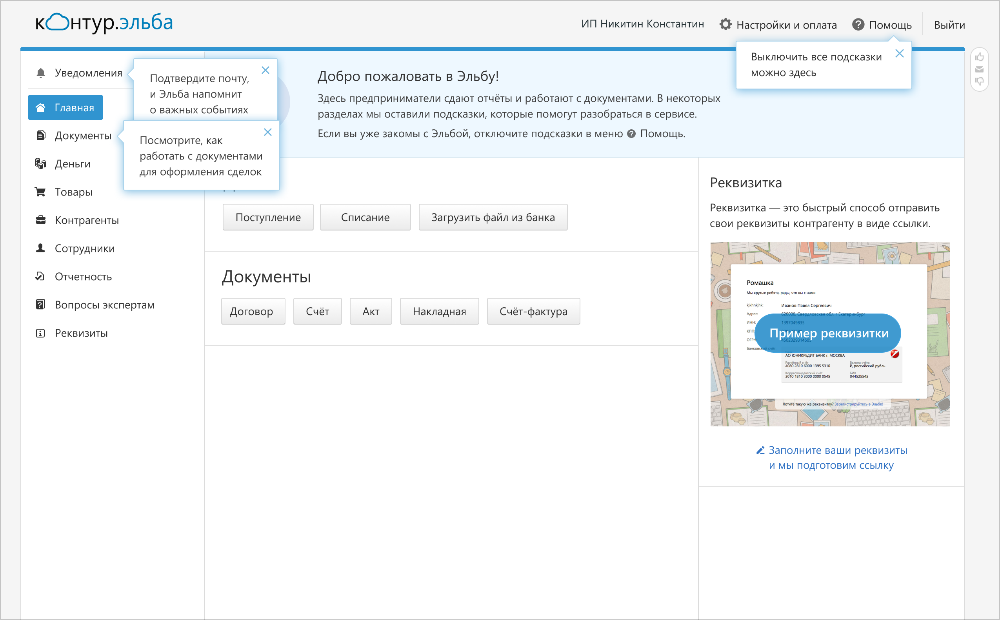
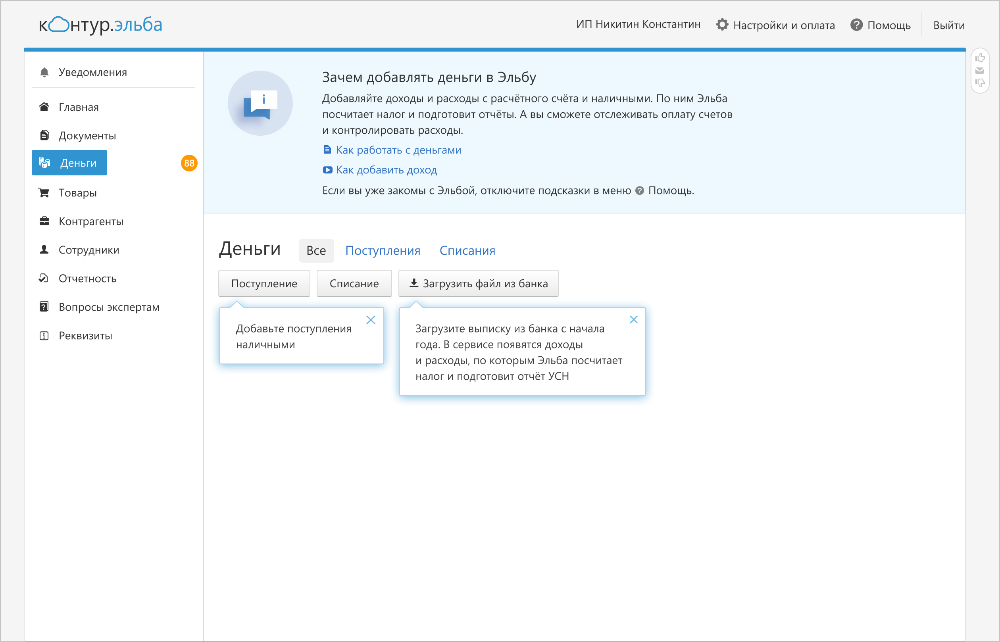
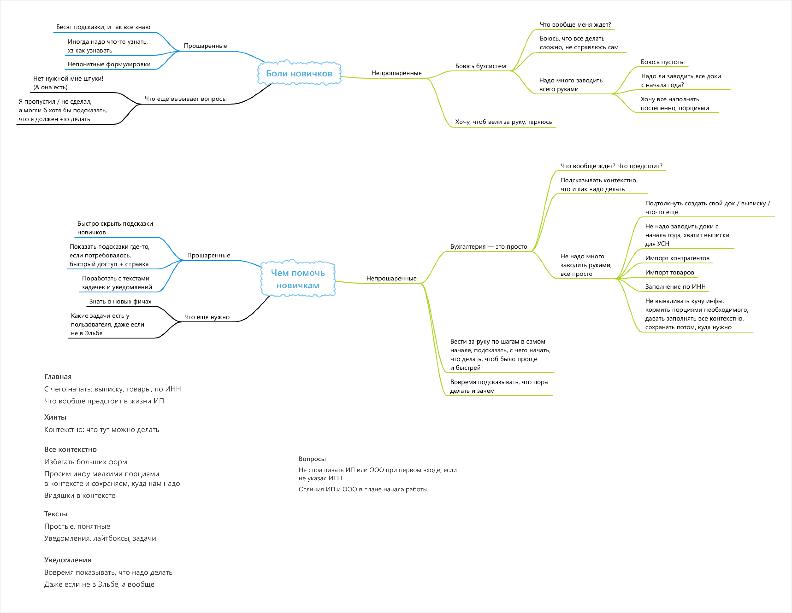

# Онбординг для новых пользователей Эльбы

Эльба&nbsp;&mdash; интернет бухгалтерия для&nbsp;ИП и&nbsp;ООО. Пользователи&nbsp;&mdash; предприниматели, директора.

## Задача

С&nbsp;годами Эльба обросла возможностями. Появилась задача сориентировать новых пользователей, чтобы они не&nbsp;терялись в&nbsp;новом для них сервисе.

## Решение

Я&nbsp;разработала систему подсказок и&nbsp;их&nbsp;поведение. Часть подсказок играет **навигационную функцию** и&nbsp;ведет пользователя буквально &laquo;за&nbsp;ручку&raquo;&nbsp;&mdash; это всплывающие тултипы. Их&nbsp;цель&nbsp;&mdash; чтобы пользователь не&nbsp;растерялся в&nbsp;обилии информации, функциональности и&nbsp;нашел самое необходимое.

Другая часть подсказок выполняет **информационную функцию,** рассказывает, для чего нужен тот или иной раздел в&nbsp;сервисе, что происходит на&nbsp;этой странице&nbsp;&mdash; это блок текста в&nbsp;верхней части основных разделов. Иногда там есть ссылки на&nbsp;полезные статьи и&nbsp;видео из&nbsp;Справочной Эльбы для тех, кто хочет знать больше. Эти подсказки помогают пользователям справляться со&nbsp;своими задачами.

Для решения задачи онбординга я&nbsp;изучала интервью с&nbsp;пользователями, где они делились своим опытом начала ведения бухгалтерии. Всю информацию я&nbsp;агрегировала в&nbsp;схему, делала заметки по&nbsp;ключевым моментам:

Часть пользователей оказалась &laquo;знающей&raquo;, они понимали, что их&nbsp;ждет в&nbsp;предпринимательской жизни, их&nbsp;раздражали лишние подсказки. Но&nbsp;при этом они иногда не&nbsp;находили нужные кнопки, какие-то возможности. Другая часть пользователей боялась бухсистем, не&nbsp;понимала, что их&nbsp;ждет, боялась не&nbsp;справиться. Они хотели, чтобы их&nbsp;&laquo;вели за&nbsp;ручку&raquo; и&nbsp;обо всем рассказывали.

Нужно было разработать решение, которое будет ненавязчиво рассказывать о&nbsp;продукте. Я&nbsp;сделала подсказки отключаемыми. Они включены по&nbsp;умолчанию при первом входе в&nbsp;сервис, но&nbsp;их&nbsp;можно выключить, чтобы не&nbsp;раздражали.

Кроме этого, мы&nbsp;ограничили число навигационных подсказок на&nbsp;странице&nbsp;&mdash; максимум три подсказки. Они исчезают навсегда, если пользователь закрыл их&nbsp;крестиком или переходил в&nbsp;раздел, на&nbsp;который они указывают. То&nbsp;есть они не&nbsp;беспокоят пользователя излишне.

Информационные подсказки с&nbsp;пояснениями к&nbsp;разделу в&nbsp;верхней части страницы видны всегда, не&nbsp;исчезают, пока включен режим подсказок. Информация на&nbsp;них полезна не&nbsp;только при первом визите, но&nbsp;и&nbsp;при дальнейшей работе в&nbsp;сервисе.
