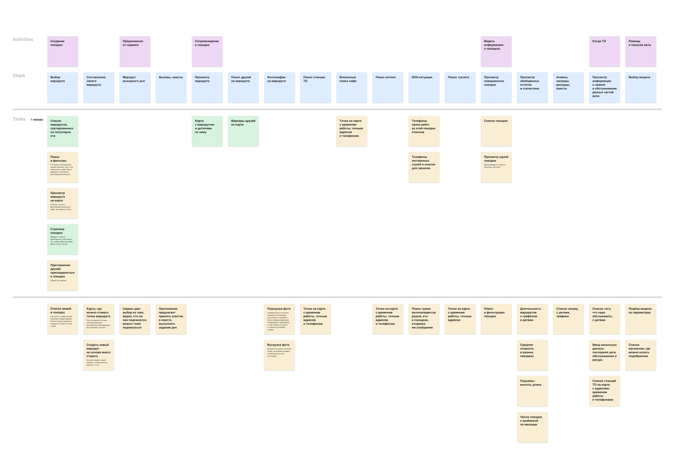

# Приложение для организации велопоездок

Задача из тестового задания.

## Постановка задачи

Создать приложение для организации поездок на&nbsp;велосипеде. В&nbsp;рамках тестового задания нужно:

1. Провести исследование, чтобы понять, что это будет за&nbsp;приложение.
2. Спроектировать три экрана приложения.

## Решение

[&#128421;&nbsp;Презентация решения](https://www.figma.com/proto/3x8wJcfgl0R9AFsCEdmgZi/Приложение-для-велопоездок?page-id=15%3A122&node-id=15-2584&viewport=501%2C534%2C0.1&scaling=scale-down&starting-point-node-id=15%3A2584&hotspot-hints=0&hide-ui=1)

### 1.&nbsp;Исследование

Я&nbsp;провела 4&nbsp;интервью с&nbsp;велосипедистами разных уровней подготовки, стилей езды и&nbsp;предпочтений по&nbsp;поездкам.

#### Вопросы для интервью

1. Как давно катаешься на&nbsp;велосипеде?
2. Тип езды: любишь быстро или расслабленно?
3. На&nbsp;какие расстояния ездишь?
4. На&nbsp;сколько часов поездка?
5. Местность: город или лес, трасса?
6. Телефон обычно в&nbsp;рюкзаке или где-то под рукой?
7. Как поступаешь с&nbsp;едой, если долгая поездка?
8. Обычно в&nbsp;компании или один?
9. Какие проблемы при планировании поездок?
10. Легко&nbsp;ли найти компанию и&nbsp;договориться?
11. Легко&nbsp;ли составить маршрут? Как выбираете?
12. Что нравится поездках (общение, природа, места, физактивность)?
13. Что не&nbsp;нравится? Что хотелось&nbsp;бы улучшить, изменить, чего не&nbsp;хватает?
14. Представь, что есть волшебное приложение для организации поездок. Что оно должно уметь, в&nbsp;чем помогать? Самые фантастические желания.
15. Представь, что есть приложение, которое предложит тебе:
16. Выбрать или составить маршрут.
17. Поможет собрать группу для поездки.
18. Предложет скидки в&nbsp;кафе по&nbsp;маршруту.
19. Покажет туалеты на&nbsp;карте, если едешь по&nbsp;городу.
20. В&nbsp;приложении есть платные и&nbsp;бесплатные возможности. Воспользуешься&nbsp;ли им?

#### Ответы респондентов

 
Респодрентка&nbsp;1

<ol>
<li>Катается лет&nbsp;8, не&nbsp;часто.</li>
<li>Любит кататься небыстро, осторожно, боится упасть. Любит по&nbsp;велодорожкам, проезжей части избегает.</li>
<li>В&nbsp;начале сезона около 10&nbsp;км, потом можно и&nbsp;на&nbsp;30&nbsp;км.</li>
<li>Пара часов на неделе, 4 на выходных.</li>
<li>Не&nbsp;дремучий лес, город, парки.</li>
<li>Держатель на&nbsp;руле, ездит с&nbsp;трекером.</li>
<li>Нет.</li>
<li>2-3&nbsp;человека, иногда до&nbsp;30.</li>
<li>Проблем особых нет. Составить маршрут проблема. Доехать до&nbsp;маршрута тоже.</li>
<li>Нет проблем найти. Обычно пару друзей беру.</li>
<li>Знать исследованные маршруты.</li>
<li>Просто ехать, катиться, по&nbsp;паркам.</li>
<li>Сейчас проблемы со&nbsp;спиной, надо подобрать вел. <b>Сложности с&nbsp;парковкой, если хочется зайти в&nbsp;кафе.</b></li>
<li><b>Показать: где есть велодорожки. Безопасные парковки. Исследованные маршруты.</b></li>
<li>Купить приложение не&nbsp;готова, ездит редко, но&nbsp;бесплатными фичами&nbsp;бы пользовалась.</li>
</ol>

 
Респодрентка&nbsp;2

<ol>
<li>Катается 4&nbsp;года активно, а&nbsp;так с&nbsp;детства.</li>
<li>Не&nbsp;очень быстро, потому что в&nbsp;компании.</li>
<li>70-80-100&nbsp;км, или 15&nbsp;км до&nbsp;работы.</li>
<li>На&nbsp;целый день.</li>
<li>Леса. Иногда на&nbsp;электричке до&nbsp;маршрута и&nbsp;потом уже на&nbsp;веле.</li>
<li>В&nbsp;поясной сумочке. Есть умные часы.</li>
<li>Иногда небольшой перекус. Но&nbsp;бывало и&nbsp;с&nbsp;котелком. Чаще только воду.</li>
<li>Компания. Одна только на&nbsp;работу.</li>
<li>Нет проблем, все планирует Макс :)</li>
<li>Если сама собирает, то&nbsp;3-4&nbsp;человека. Зазывает красивыми видами, фоточками, кофем.</li>
<li>Тяжело строить маршрут. Хочу лес, без машин, без подъемов. Сложно встать рано :)</li>
<li>Красивая природа, состояние путешествия, приключения, заряжаешься от&nbsp;этого. Приятная нагрузка. Фоточки.</li>
<li>Макс думает за&nbsp;все, за&nbsp;инструменты тоже. Но&nbsp;было, что связи не&nbsp;было в&nbsp;некоторых местах&nbsp;&mdash; это прямо совсем плохо, если потерялся. Бывает дорога в&nbsp;г... после дождя, знать&nbsp;бы как объехать. Горки не&nbsp;нравится, хочу знать, где они есть, где нет.</b></li>
<li>Хочу знать, кто где на&nbsp;маршруте, когда собираемся и&nbsp;в&nbsp;поездке, метки людей. Чек-листы, что не&nbsp;забыть взять с&nbsp;собой (вода, комары, баф, еда, кто что берет). Маршруты. Интегрировать отчеты из&nbsp;Стравы. Считать суммарный пробег, чтобы вовремя проходить&nbsp;ТО по&nbsp;отдельным частям вела. Советы по&nbsp;выбору велика начинающим.</li>
<li>Важно удобство использования приложения, это ключевое, потому что есть серьезные конкуренты типа Стравы. Любит статистику, поэтому хотела&nbsp;бы тут ее&nbsp;смотреть. Пользовалась&nbsp;бы.</li>
</ol>

 
Респодрент&nbsp;3

<ol>
<li>Катается с&nbsp;детства.</li>
<li>По&nbsp;ситуации, бывает и&nbsp;быстро, бывает и&nbsp;медленно.</li>
<li>По&nbsp;ситуации, бывает и&nbsp;быстро, бывает и&nbsp;медленно.</li>
<li>На&nbsp;весь день.</li>
<li>Лес, трасса, ЮЗ-лесопарк. Зимой по&nbsp;городу.</li>
<li>Телефон обычно убран.</li>
<li>Чаще в&nbsp;кафе, иногда перекусы. Планирует заранее в&nbsp;где можно будет поесть.</li>
<li>Чаще катает один. Но&nbsp;в&nbsp;компании тоже ездит.</li>
<li>Сложно строить маршруты, потому что едешь по&nbsp;новому и&nbsp;упираешься во&nbsp;что-то закрытое или непроходимое. Обычно катает по&nbsp;старым своим маршрутам.</li>
<li>Тяжело ищется.</li>
<li>Маршруты сложно строить.</li>
<li>Это как путешествие, природа нравится. Запахи.</li>
<li>Запчасти сложно искать, дорого. Экипировка. Сейчас из-за санкций все очень дорого и&nbsp;выбора нет. Некачественное.</li>
<li>

Каждые выходные волшебное приложение предлагает маршруты на&nbsp;выбор. Их&nbsp;лайкают или как-то отвечают, что поедут. И&nbsp;потом смотришь, сколько человек на&nbsp;него подписалось и&nbsp;едешь. Компания собирается сама, тебе ничего не&nbsp;надо делать.

Нужен еще прогноз погоды. Где закупиться, магазы и где поесть. Достопримечательности на маршруте. Где можно сесть на электричку, если устал.

Чек-листы, чем закупиться. Приложение видит длину маршрута, считает, сколько каллорий потеряешь и&nbsp;составляет примерный список, сколько надо съесть и&nbsp;выпить, чтобы восполнить запасы энергии.

По&nbsp;ТО, чтобы можно было заводить, когда поменял что-то и&nbsp;какой у&nbsp;этой детали ресурс, чтобы приложение напомнило.

Разную статистику. По&nbsp;маршруту, чтобы можно было фильтровать &laquo;только грунт&raquo;, &laquo;только по&nbsp;дороге&raquo;.

Игровая механика, ачивки, достижения. В&nbsp;каком-то приложении надо закрасить все квадратики на&nbsp;карте&nbsp;&mdash; места, где ты&nbsp;был. Социальная составляющая, фоточки. Рекорды и&nbsp;квесты. Нужны клубы. Типа как сообщества. Тренировки товарищей и&nbsp;другая статистика.

</li>
<li>Пользовался&nbsp;бы приложением.</li>
</ol>

 
Респодрент&nbsp;4

<ol>
<li>Катается 11&nbsp;лет.</li>
<li>Тип езды: расслбленная большую часть времени.</li>
<li>На&nbsp;работу бывает, а&nbsp;если нет, то&nbsp;10-20-30&nbsp;км.</li>
<li>2-4&nbsp;часа.</li>
<li>Смешанная местность. По&nbsp;городу или трассе быстрее по&nbsp;времени, но&nbsp;расстояние больше, а&nbsp;по&nbsp;лесу дольше по&nbsp;времени и&nbsp;расстояния меньше.</li>
<li>Телефон на&nbsp;руле.</li>
<li>С&nbsp;собой вода, перекус редко, если есть, то&nbsp;батончик. Обычно когда в&nbsp;лес, есть перекус. Если короткие поездки и&nbsp;город, то&nbsp;в&nbsp;кафе.</li>
<li>Обычно один, компанию тяжело собрать.</li>
<li>Не&nbsp;ясно заранее, комфортный&nbsp;ли участок дороги. Часто популярные маршруты Стравы совпадают с&nbsp;пешеходными, пересечение потоков это не&nbsp;удобно. Хотелось&nbsp;бы инфу по&nbsp;дороге: если трасса, есть&nbsp;ли асфальтированная обочина. Если лес&nbsp;&mdash; тропинки или дремучий лес. Город&nbsp;&mdash; велодорожки. То&nbsp;есть типы покрытия. Перепады высот надо знать, но&nbsp;это сложная инфа для новичков, надо ее&nbsp;как-то визуализировать. Приколько&nbsp;бы, если&nbsp;бы люди лайкали куски маршрута, чтобы было понятно, что тут ок&nbsp;ехать, а&nbsp;тут нет. Не&nbsp;хватает каталога маршрутов.</li>
<li>В&nbsp;30&nbsp;всегда сложно искать компанию.</li>
<li>В&nbsp;п.9 подробно говорили про маршруты. Составить маршрут не&nbsp;проблема, сложнее выбрать один из&nbsp;вариантов пути. Обычно хочу составить маршрут к&nbsp;какому-то объекту, например: хочу посмотреть вот ту&nbsp;лужу в&nbsp;той деревне и&nbsp;выпить там чай.</li>
<li>Нравится ощущение полета. Возможность добраться туда, куда не&nbsp;дойдешь ногами, а&nbsp;авто я&nbsp;не&nbsp;рассматриваю.</li>
<li>Иногда небезопасно, с&nbsp;этим приходится мириться: автотрассы, пешеходы. Нехватка инфраструктуры: набрать воды, отдохнуть в&nbsp;тихом месте, чтобы не&nbsp;на&nbsp;обочине трассы. Нет возможности уехать туда на&nbsp;электричке, а&nbsp;вернуться на&nbsp;веле. Непонятно, куда и&nbsp;зачем ехать. Некоторые маршруты хочется покатать, но&nbsp;нужен другой тип вела&nbsp;&mdash; тут&nbsp;бы прокат велов, но&nbsp;мало инфраструктуры.</li>
<li>Каталог маршрутов с&nbsp;числом людей, которые катались по&nbsp;нему. Перепады высот, длительность. Готов вписываться с&nbsp;масштабные группы 10-15-30&nbsp;человек, это безопаснее, чем с&nbsp;2-3&nbsp;незнакомцами. Если еще у&nbsp;поездки верифицированный организатор, вообще здорово. Платные и&nbsp;бесплатные поездки. Поездки от&nbsp;магазинов и&nbsp;велопрокатов. Доставка прокатного вела домой. На&nbsp;маршрутах нужны points of&nbsp;interest, всякие беседки, холмики, интересные места, достопримечательности.</li>
<li>Попробовал&nbsp;бы это приложение ради совместных поездок (events) и&nbsp;ради прокатных велов на&nbsp;интересных маршрутах.</li>
</ol>

#### Выводы из&nbsp;интервью

Я&nbsp;выявила текущие проблемы велосипедистов и&nbsp;их&nbsp;потребности, когда они планируют поездки на&nbsp;велосипеде.

1. У&nbsp;всех участников опроса есть проблемы с&nbsp;составлением маршрутов. Не&nbsp;понятно проходимые&nbsp;ли дороги, нет&nbsp;ли препятствий, предупреждения об&nbsp;участках без мобильной связи.
2. Многим важно знать заранее, какой тип дороги: асфальт, велодорожка, трасса, лесные тропы с&nbsp;грунтом.
3. Есть проблема собрать компанию для поездки.
4. Есть проблема с&nbsp;обедами в&nbsp;кафе&nbsp;&mdash; у&nbsp;многих кафе хранить велосипеды не&nbsp;безопасно, угоняют.
5. Удобно было&nbsp;бы, если&nbsp;бы приложение напоминало о&nbsp;том, когда надо менять или обслуживать запчасти.

#### Рекомендации

1. Предложить заранее продуманные проходимые маршруты, с&nbsp;информацией: по&nbsp;дорожному покрытию, длине маршрутов и&nbsp;их&nbsp;сложности (про длительные подъемы в&nbsp;гору хотят знать заранее).
2. Запартнериться с&nbsp;кафе, которые могут предложить безопасное хранение велосипеда во&nbsp;время обеда и&nbsp;скидки для велосипедистов.
3. Отметить на&nbsp;карте кафе, велопарковки, аптеки.
4. При организации поездки дать возможность приглашать участников и&nbsp;общаться с&nbsp;ними.
5. В&nbsp;перспективе можно добавить раздел пр&nbsp;отехническое обслуживание велосипеда, с&nbsp;напоминаниями и&nbsp;рекламой тех. станций.

### 2.&nbsp;Аналитика

После интервью стало понятно, какие сценарии есть у&nbsp;пользователей, какие фичи должны быть в&nbsp;приложении, чтобы решить проблемы и&nbsp;потребности пользователей.

1. Я&nbsp;составила Story Map, чтобы понять, какие сценарии пользователей должны быть реализованы в&nbsp;приложении.
2. Детализировала: какие экраны и&nbsp;фичи нужны для покрытия этих сценариев и&nbsp;решения проблем пользователей.
3. Выделила основные фичи для первого релиза.
4. Выбрала для проектирования три экрана:
5. Routes&nbsp;&mdash; список маршрутов с&nbsp;фильтрацией.
6. New Ride&nbsp;&mdash; экран создания новой поездки.
7. On&nbsp;the Way&nbsp;&mdash; экран с&nbsp;картой в&nbsp;процессе поездки.

### 3.&nbsp;Прототипы

#### Routes

Список маршрутов.

1. Главный экран&nbsp;&mdash; это список маршрутов. В&nbsp;верхней части на&nbsp;всю ширину показываем маршрут спонсора.
2. Пользователь может отфильтровать список по&nbsp;своим предпочтениям.

#### New Ride

Создание новой поездки.

На&nbsp;предыдущем экране пользователь выбрал маршрут для новой поездки. Здесь он&nbsp;указал время старта и&nbsp;добавил участников.

По&nbsp;клику карта открывается на&nbsp;весь экран. На&nbsp;ней отмечены интересные места, аптеки, велостанции. Там&nbsp;же пользователь может выбрать кафе для обеда.

На&nbsp;экране новой поездки он&nbsp;видит погоду на&nbsp;ближайшее время. Он&nbsp;может перейти в&nbsp;чат с&nbsp;участниками или начать поездку.

#### On&nbsp;the way

Во время поездки.

Пользователь нажал кнопку старта. На&nbsp;полный экран открылась карта. На&nbsp;ней показаны метки участников поездки. Цвет маршрута определяется высотой подъема.

Можно включить слои, чтобы показать на&nbsp;карте: интересные места, кафе, аптеки, велостанции. Можно открыть чат с&nbsp;участниками.

Если потянуть вверх нижнюю шторку, сначала покажется график с&nbsp;высотами.

Если потянуть шторку выше, появится кнопка окончания поездки и&nbsp;кнопка SOS. С&nbsp;помощью SOS можно отправить сообщение всем ближайшим велосипедистам на&nbsp;разных маршрутах.
