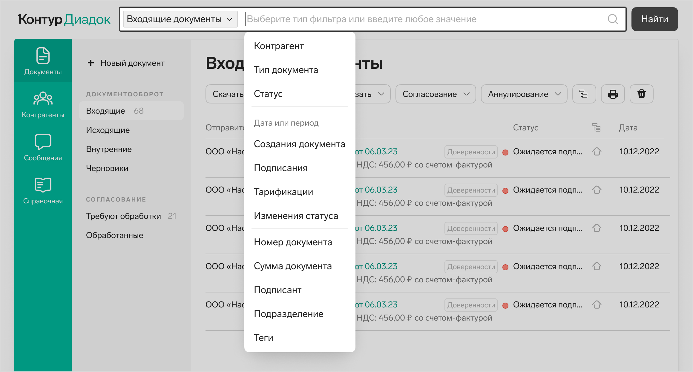
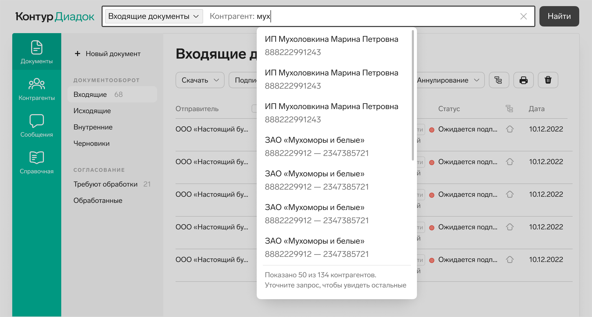
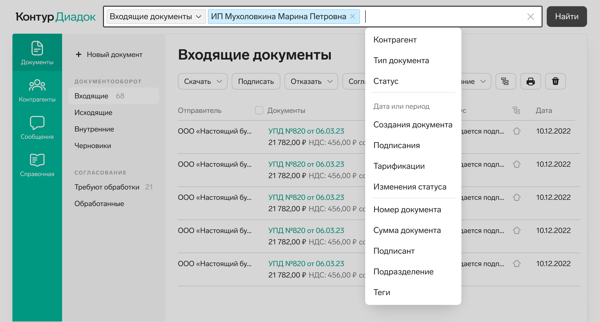
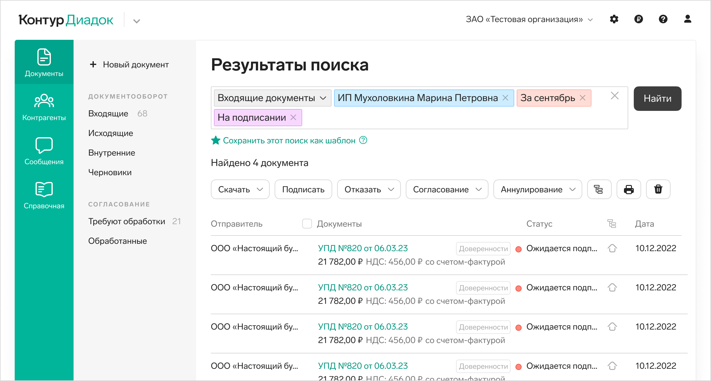
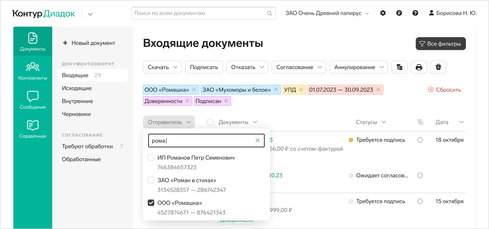
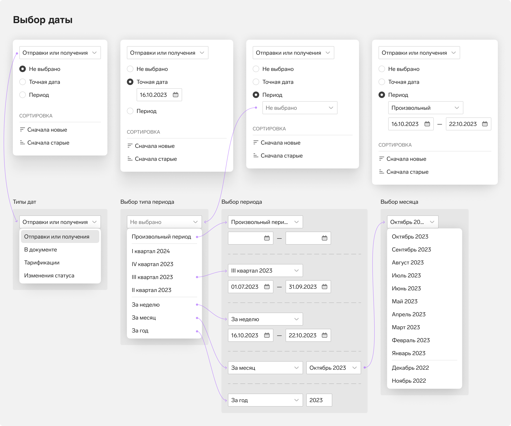

# Поиск и фильтрация документов в Диадоке

## Проблемы прошлого решения

Прошлое решение состоит из&nbsp;полнотекстового поиска и&nbsp;расширенных фильтров. У&nbsp;пользователей есть трудности с&nbsp;этим решением:

1. Полнотекстовый поиск не&nbsp;дает хорошую выдачу, ищет по&nbsp;всем полям документов&nbsp;&mdash; это неудобно.
2. Расширенный поиск не&nbsp;дает выбирать несколько сущностей одного типа: например, несколько контрагентов. Текущих полей для фильтрации, не&nbsp;хватает, надо больше: теги, подразделения, подписант и&nbsp;т.&nbsp;д.

Кроме того, нельзя сохранить часто используемый шаблон поиска. Пользователи это не&nbsp;просят напрямую, но&nbsp;если смотреть на&nbsp;их&nbsp;сценарии, им&nbsp;это очень нужно.

## Задачи на основе проблем

- Уметь выбирать несколько одинаковых сущностей.
- Добавить еще поля для поиска.
- Уметь сохранять часто используемые шаблоны поиска.
- Попробовать совместить поиск и&nbsp;фильтрацию в&nbsp;одном инструменте.
- Сделать инструмент поиска максимально простым и&nbsp;понятным для пользователя.

## Первая концепция

Полнотекстовый поиск, совмещенный с фильтрами.

Кликнули в&nbsp;поле поиска.

- Поле увеличилось на&nbsp;всю ширину, снизу затемняющая основной контент вуаль.
- Автоматом выбран раздел, в&nbsp;котором мы&nbsp;находились&nbsp;&mdash; &laquo;Входящие документы&raquo;. Иногда пользователям нужно искать не&nbsp;в&nbsp;конкретном разделе, а&nbsp;во&nbsp;всех сразу. Можно выбрать другой&nbsp;&mdash; в&nbsp;неудаляемой выпадашке.
- Одновременно с&nbsp;фокусом в&nbsp;поле раскрылся список с&nbsp;предложением выбрать тип фильтра, по&nbsp;которому будем искать.

После выбора типа фильтра можно начать вводить значение:

Начали вводить название контрагента. Поле работает как автокомплит — выводит список контрагентов:

Выбрали контрагента из&nbsp;списка.

- Контрагент превратился в&nbsp;токен.
- Серая подсказка с&nbsp;названием типа фильтра исчезла. При наведении на&nbsp;токен в&nbsp;хинте будет подсказка с&nbsp;типом фильтра.
- Для разных типов сущностей разные цвета, контрагенты&nbsp;&mdash; голубого.
- Фокус автоматом снова встал в&nbsp;поле и&nbsp;появилась выпадашка с&nbsp;типами фильтров&nbsp;&mdash; выбор фильтра и&nbsp;значения можно повторить заново.
- Если дважды кликнуть на&nbsp;токен, он&nbsp;перейдет в&nbsp;режим редактирования: превратится обратно в&nbsp;текст, появится автокомплит по&nbsp;контрагенту.

Выбрали все нужные фильтры и&nbsp;нажали кнопку &laquo;Найти&raquo;.

- Строка поиска переезжает из&nbsp;шапки в&nbsp;рабочую область.
- Можно отредактировать значения в&nbsp;токенах и&nbsp;поискать заново.
- Можно сохранить этот поиск как шаблон и&nbsp;использовать его позже.
- Можно ввести в&nbsp;поле какую-то фразу без выбора фильтра — по&nbsp;ней будет идти полнотекстовый поиск.

### Шаблоны фильтров

Если у&nbsp;пользователя есть сохраненные шаблоны поиска, то&nbsp;в&nbsp;раскрывающемся списке с&nbsp;типами фильтров первой строкой будет &laquo;Шаблон поиска&raquo;.

Плюсы этой концепции — поиск и&nbsp;фильтры это один инструмент. Пользователю не&nbsp;надо думать, что использовать для решения своей задачи.

Тем&nbsp;не&nbsp;менее, у&nbsp;команды были сомнения, справятся&nbsp;ли пользователи с&nbsp;таким непривычным инструментом поиска. Действительно, решение не&nbsp;такое уж&nbsp;простое. Поэтому я&nbsp;спроектировала более знакомый для&nbsp;пользователей вариант. Позже мы&nbsp;проверили на&nbsp;юзабилити-тестировании, как пользователи справляются с&nbsp;каждым из&nbsp;решений.

## Вторая концепция

В&nbsp;этой концепции быстрые фильтры совмещены с&nbsp;шапкой таблицы. Остальные фильтры спрятаны за&nbsp;кнопкой «Все фильтры».

По&nbsp;клику на&nbsp;заголовок столбца раскрывается список с&nbsp;набором значений. В&nbsp;нем можно поискать нужное&nbsp;&mdash; поле поиска над строками с&nbsp;чекбоксами.

После выбора значения, оно появляется над таблицей в&nbsp;виде токена. Цвет токена зависит от&nbsp;типа фильтра. Токен удаляется по&nbsp;крестику и&nbsp;фильтрация сбрасывается. Справа от&nbsp;токенов есть кнопка сброса всех фильтров.

По&nbsp;кнопке &laquo;Все фильтры&raquo; открывается лайтбокс со&nbsp;всеми возможными фильтрами.

В&nbsp;левой части&nbsp;&mdash; кнопки-списки с&nbsp;возможностью поиска и&nbsp;множественным выбором, как в&nbsp;шапке таблицы на списке. Вот некоторые из&nbsp;них:

После выбора значения в&nbsp;каком-то из&nbsp;полей, оно выводится в&nbsp;виде токена в&nbsp;нижней части лайтбокса. Там можно увидеть, какие фильтры уже выбраны и&nbsp;будут применены после нажатия на&nbsp;кнопку &laquo;Применить&raquo;.

Поля, в&nbsp;которых выбрано хотя&nbsp;бы одно значение дополнительно отмечено цветным кружочком&nbsp;&mdash; его цвет совпадает с&nbsp;цветом токена этого фильтра. Так пользователю проще находить поля и&nbsp;кнопки, в&nbsp;которых выбраны какие-то значения и&nbsp;редактировать&nbsp;их. Не&nbsp;приходится читать название кнопок или полей, это ускоряет работу.

### Шаблоны фильтров

В&nbsp;лайтбоксе около выбранных токенов есть ссылка для того, чтобы сохранить этот набор фильтров как шаблон:

Когда пользователь выбирает шаблон, в&nbsp;раскрывающемся списке выводится название шаблона, а&nbsp;в&nbsp;нижней части лайтбокса выводятся токены&nbsp;&mdash; фильтры из этого шаблона.

Если после выбора шаблона добавить еще какие-то фильтры, они добавятся к&nbsp;уже выбранным фильтрам из&nbsp;шаблона, но&nbsp;в&nbsp;поле &laquo;Шаблоны фильтров&raquo; уже не&nbsp;будет выводиться название шаблона, потому что новый набор фильтров ему уже не&nbsp;соответствует.

Если выбран какой-то шаблон, рядом появляются кнопки редактирования названия и&nbsp;удаления шаблона.

Шаблон удаляется с&nbsp;подтверждением:

Если нет сохраненных шаблонов, то&nbsp;в&nbsp;раскрывающемся списке пишем подсказку&nbsp;&mdash; что нужно сделать, чтобы шаблоны появились.

Из плюсов этой концепции — она привычна пользователям, значения выбираются с&nbsp;помощью стандартных контролов. Из&nbsp;минусов&nbsp;&mdash; полнотекстовый поиск и&nbsp;фильтрация остаются разделенными. Потенциально пользователи могут не&nbsp;находить строку поиска, которая значительно удалена от&nbsp;рабочей области с&nbsp;фильтрами.

Дальше мы&nbsp;протестировали обе концепции на&nbsp;пользователях, чтобы понять, какое решение лучше.

## Юзабилити-тестирование

### Задание на ЮТ

Мы&nbsp;давали пользователям задание найти документы по&nbsp;ряду условий. В&nbsp;задании кроме выбора значений в&nbsp;фильтрах нужно было пользоваться полнотекстовым поиском.

### Итог

Пользователи одинаково хорошо справлялись как с&nbsp;первым концептом поиска, так и&nbsp;со&nbsp;вторым. Затруднений не&nbsp;было. Возможность сохранить фильтры в&nbsp;качестве шаблона замечали. Полнотекстовым поиском пользовались, не&nbsp;теряли.

Первый концепт был им&nbsp;непривычен, они об&nbsp;этом говорили. Но&nbsp;это не&nbsp;мешало выполнять задачу поиска, все было понятно. Один из&nbsp;пользователей назвал первую концепцию прогрессивной и&nbsp;лаконичной.

После того, как мы&nbsp;оценили время разработки, оказалось, что на&nbsp;первую версию поиска уйдет слишком много времени. Поэтому для реализации мы&nbsp;выбрали второе решение.
