# Поиск и&nbsp;приглашение контрагентов

Поиск и приглашение контрагентов в Диадоке — один из ключевых сценариев сервиса. От него напрямую зависит число пользователей сервиса.

В разделах, которые касаются этого сценария, есть ряд проблем, которые мы выявили на юзабилити-тестированиях (ЮТ). Я решала задачу полного редизайна раздела.

## Контекст

В Диадоке организации подписывают документы и обмениваются ими друг с другом. Прежде чем начать обмен документами, одна организация должна пригласить другую к обмену документами, а вторая — принять приглашение. Поиск и приглашение контрагентов реализован в отдельном разделе.

Есть два способа приглашать контрагентов. Первый — поискать организацию по названию, ИНН или идентификатору участника ЭДО (электронного документооборота) через поисковую строку. Второй — загрузить файл со списком всех своих контрагентов, чтобы пригласить их массово.

## Единичный поиск

### Старое решение

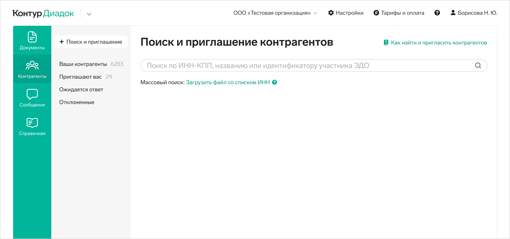

Это поиск через поисковое поле. Поисковая выдача поделена на три группы:

* Работают в Диадоке — организации, которые зарегистрированы в Диадоке и ведут обмен документами.
* Еще не обменивались документами в Диадоке — мы видим, что эти организации есть в Диадоке, но обмена документами с другими организациями не было.
* Не подключены к Диадоку — организации, которые не зарегистрированы в Диадоке.

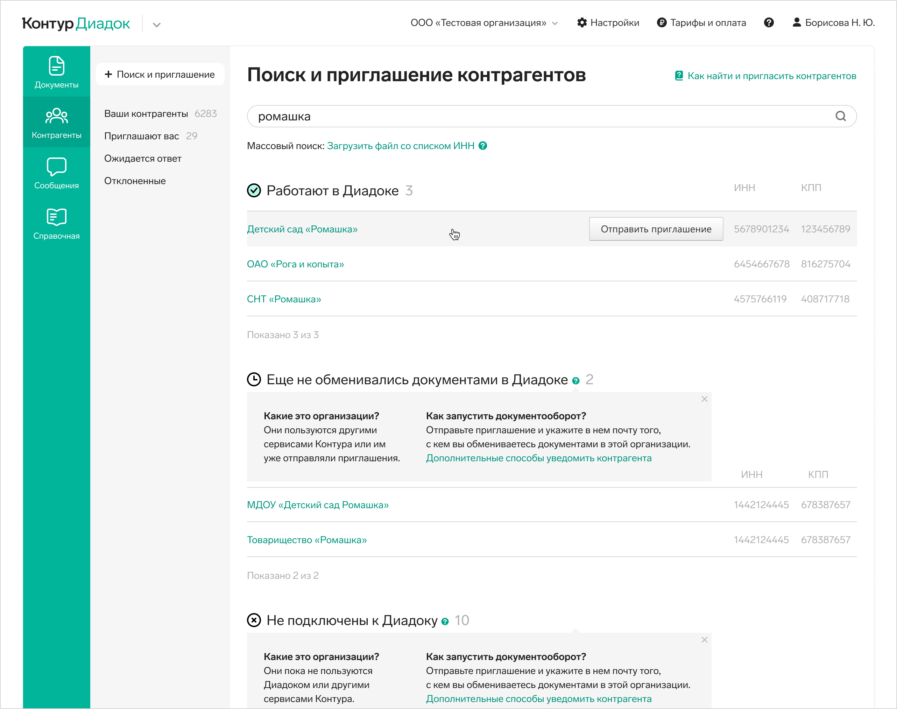

Контрагента можно пригласить к обмену документами прямо со списка — при наведении на строку появляется кнопка. А можно кликнуть на строку — откроется карточка контрагента, там так же есть кнопка отправки приглашения.

### Проблемы единичного поиска

1. Не все группы в поисковой выдаче понятны пользователям. Самая непонятная вторая группа. Но и к третьей есть вопросы — приглашать ли контрагента, если он попал в эту группу? Даже если попросить пользователей прочесть пояснение к группам, они не понимают, в чем суть, и как с этим работать.

2. Группы не упрощают поиск нужного контрагента, искомый контрагент может оказаться в любой из трех групп.
3. В каждой группе в поисковой выдаче только 50 контрагентов, нет пейджинга, нужно уточнить поиск, чтобы выборка стала меньше.
4. Если контрагент работает не только в Диадоке, но и в других системах ЭДО, пользователь может пригласить такого контрагента к обмену документами через роуминг. В поисковой выдаче у такой организации будет несколько строк — по одной на каждую систему ЭДО. Пользователь может выбрать, в какую из них отправить приглашение. Если строки, касающиеся систем ЭДО одного контрагента, попали в разные группы, можно пропустить нужную строку.

5. На ЮТ пользователи не сразу видели, как пригласить контрагента, когда была построена поисковая выдача. Они тянулись мышью к строке, чтобы на нее кликнуть, в этот момент в строке появлялась кнопка, они останавливались и заново принимали решение — кликнуть на кнопку или на строку. Это раздражающее поведение, пользователям было неприятно, они говорили про это.
  
Если суммировать проблемы поисковой выдачи — она слишком сложна, не помогает принять решение, можно ли отправить контрагенту приглашение, дополнительно усложнена выбором роуминговой ЭДО прямо со списка. Появляющаяся при наведении кнопка приглашения заздражает.

### Мои решения

Я подробно изучила сценарии пользователей. Изучила, какие типы контрагентов бывают, и как эти типы влияют на сценарий пользователя.

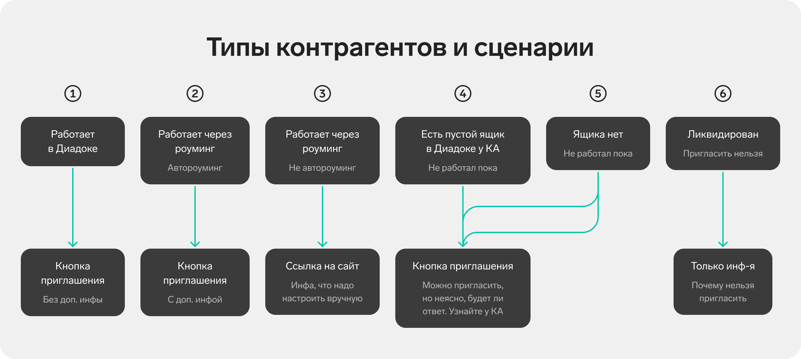

Я пересмотрела поисковую выдачу и механизм приглашения. Если идти по сценарию, пользователям сначала важно найти своего контрагента, а уже потом принимать решение, приглашать его или нет. Это зависит от того, работает ли он сейчас в Диадоке, а может работает через роуминг. Разбивка этого сценария на 2 понятных простых шага упростила процесс.

Поисковая выдача без групп, но со статусами. Если пользователь уже работает с искомым контрагентом, или он пригласил его и ждет ответ — это видно по статусу, он может не идти приглашать его.

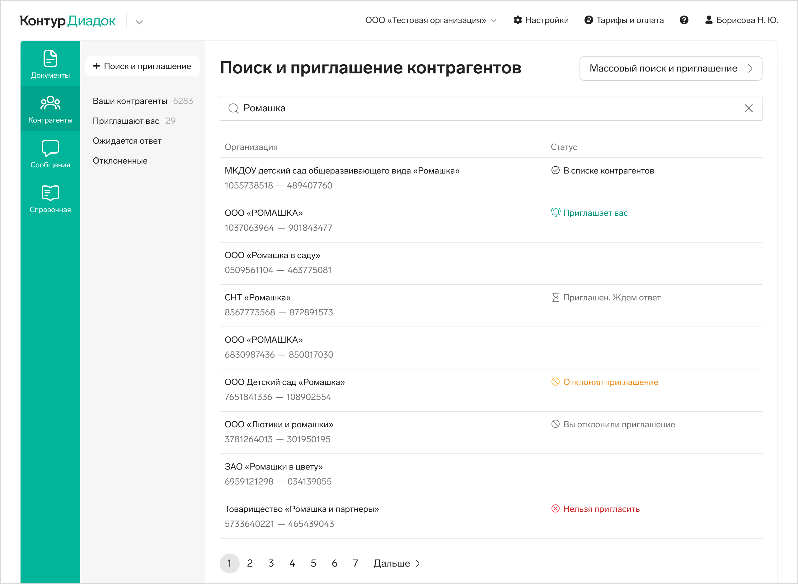

Внутри карточки контрагента полная информация о нем. Принимать решение о приглашении внутри карточки удобнее, чем со списка. Сайдпейдж открывается по клику на строку списка.

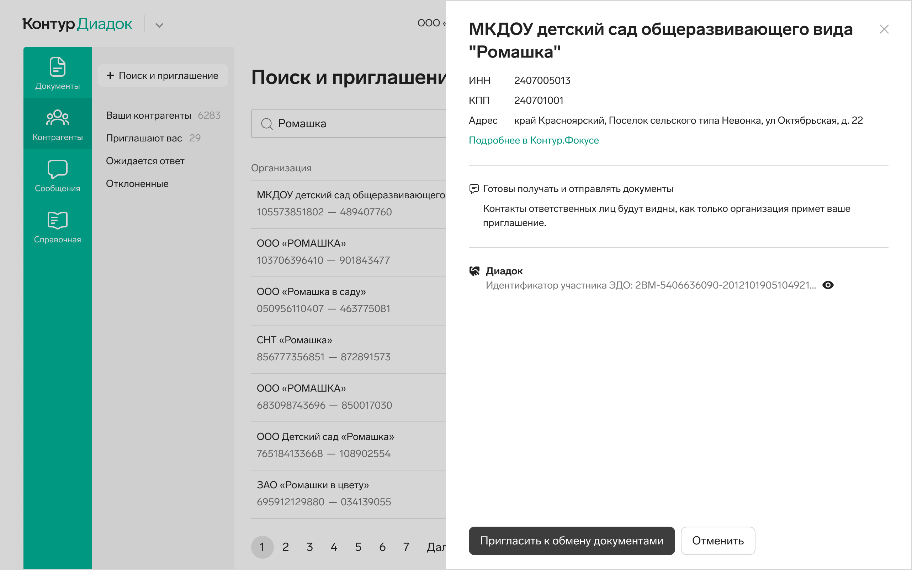

Я добавила понятные пояснения про всевозможные статусы контрагента, а так же информацию про роуминг. Пользователи хотели больше информации о нем, кто-то опасался приглашать через роуминг. Текстами я сняла эти опасения. На ЮТ убедились, что все тексты работают хорошо, пользователи понимали все, что им было нужно.

В зависимости от того, подключен ли контрагент к системам ЭДО, нижний блок в карточке может быть разным:

В поисковой выдаче теперь один контрагент — одна строка, а не несколько с разными системами ЭДО. Выбор ЭДО я перенесла в карточку контрагента, как и всю информация о нем, способах взаимодействия с ним.

Если у контрагента несколько систем ЭДО — мы даем отправить приглашение в любую из них или в несколько сразу.

После отправки приглашения пользователи видят изменения на списке, статус в строке контрагента меняется — им это важно, так они ощущают контроль, получают обратную связь после отправки приглашения.

Внутри сайдпейджа контрагента информация тоже обновляется в зависимости от его статуса. Варианты могут быть такие:

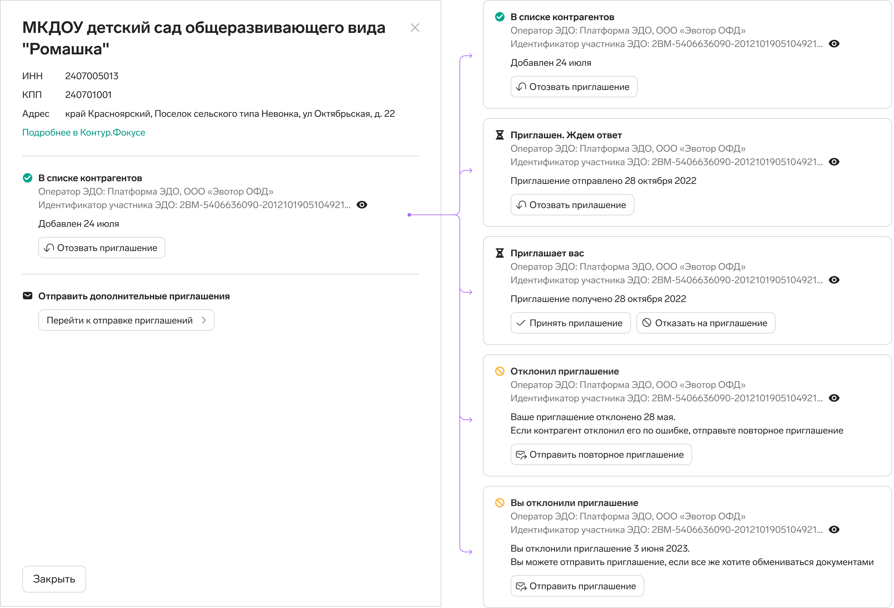

## Массовое приглашение по списку из файла

Массовыми приглашениями пользуются организации, у которых тысячи контрагентов — прглашать поштучно просто нереально, слишком трудоемко.

### Старое решение

Сейчас сценарий массового приглашения контрагентов спрятан за ссылками под поисковым полем.

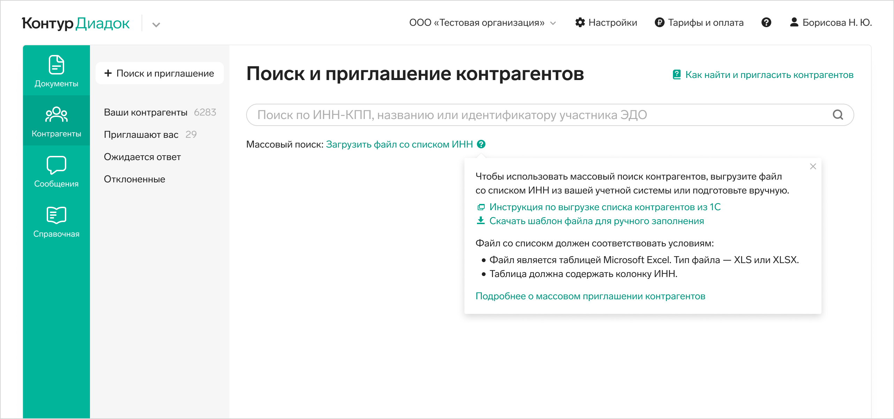

По ссылке «Загрузить файл со списком ИНН» открывается окно выбора файла для загрузки. По клику на иконку вопросика открывается тултип с инструкциями про то, какой должен быть файл и ссылкой на шаблон файла.

После загрузки файла, поисковая выдача выглядит так же, как при единичном поиске конрагента. В таблице мы показываем не всех контрагентов из файла, а по 50 в каждой группе, без пейджинга. Над всей таблицей есть кнопка приглашения контрагентов из всех групп сразу, а над каждой группой ссылки приглашений контрагентов из конкретной группы.

### Проблемы массового приглашения

1. Не все пользователи видят ссылку для массового приглашения, звонят с этими вопросами в техподдержку.
2. Пользователи ожидают увидеть по ссылке инструкцию, но по ней сразу открывается окно выбора файла.
3. Все инструкции, какой должен быть файл, справочная статья и шаблон файла спрятаны в иконку вопросика — это отдельная от ссылки кликабельная область. Инструкции не находят.
4. Как и в единичном поиске, пользователи плохо понимают значения групп, поэтому им сложно принять решение, какую группу контрагентов приглашать. Чаще они просто приглашают всех сразу и вообще не проматывают список вниз — мы наблюдали это на ЮТ.
5. Пользователям непонятно, кому будут отправлены приглашения, если они нажмут на ссылку над конкретной группой. В какие системы ЭДО пойдут приглашения тоже непонятно. После отправки приглашений нет никаких результатов, кому отправили прглашения и как именно. То есть пользователи в полном неведении, как это работает и что получается в итоге.

### Мои решения

Первое, что я сделала — перенесла массовый поиск и приглашение в большую кнопку.

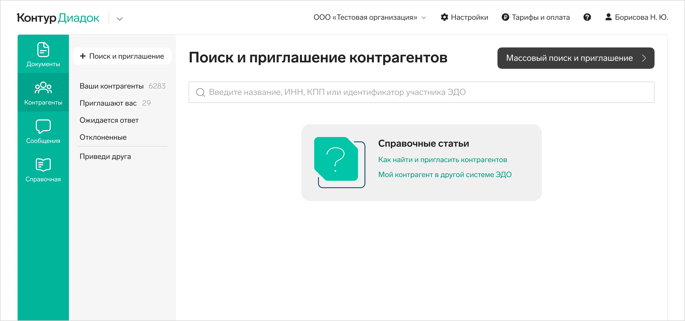

По своему визуальному весу кнопка теперь наравне с поисковым полем, как и должно быть — это равнозначный вариант поиска. По кнопке открывается сайдпейдж со всеми инструкциями и возможностью загрузки файла. Я структурировала текст со способами приглашений. Разбила визуально на этапы подготову файла и его загрузку.

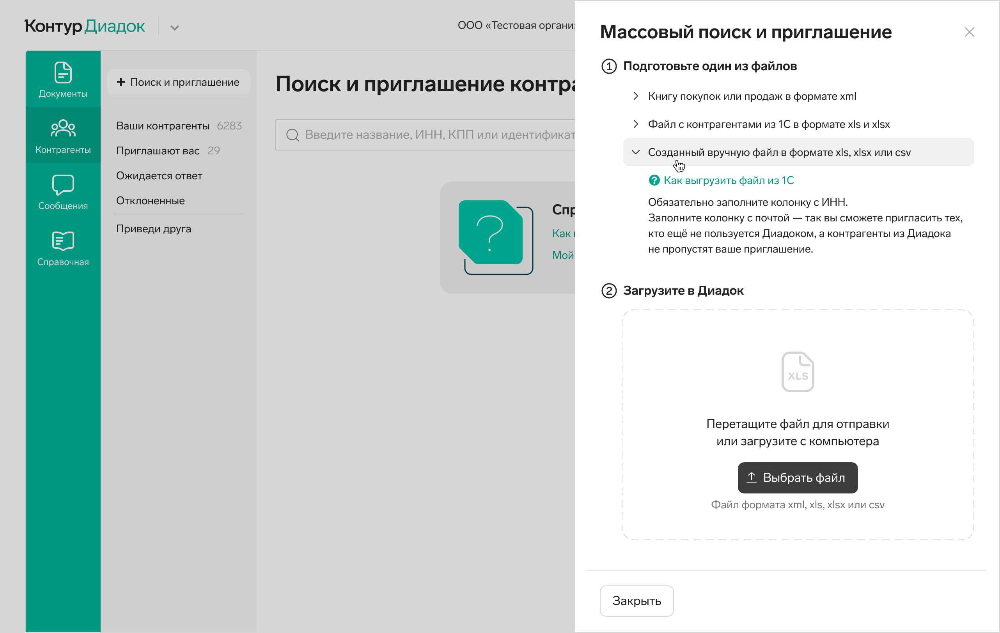

Дальше очевидным для меня решением было отказаться от поисковой выдачи после загрузки файла. В этом сценарии пользователи грузят файлом свой список, он довольно большой, его просто невозможно просмотреть глазами, да и пользы от этого нет. Нет такого сценария, что список нужно читать. Максимум, что хотели пользователи в этом сценарии — понимать, куда и кому уйдут приглашения.

У некоторых пользователей было пожелание отправлять приглашения только контрагентам из Диадока, а не через роуминг в другие операторы ЭДО. Так что после загрузки файла на втором сайдпейдже я организовала такой выбор.
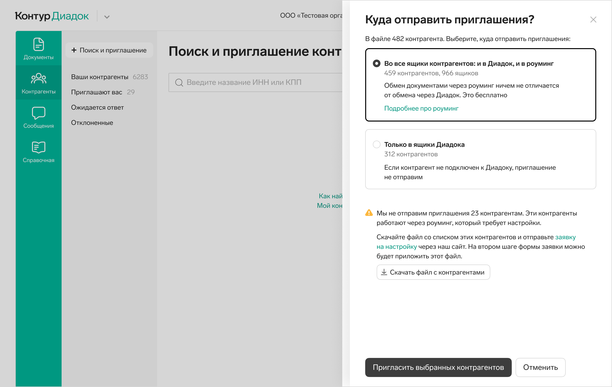

Я дала больше пояснений: скольким контрагентам мы отправим приглашения, а скольким не сможем — список с ними можно скачать, чтобы потом пригласить их отдельно.

После отправки приглашений я решила показать лайтбокс с итогами. Пользователи могут скачать файл с результатами отправки приглашений: кому отправили, в какую систему ЭДО, кому не отправили. Это то, что очень просили пользователи.

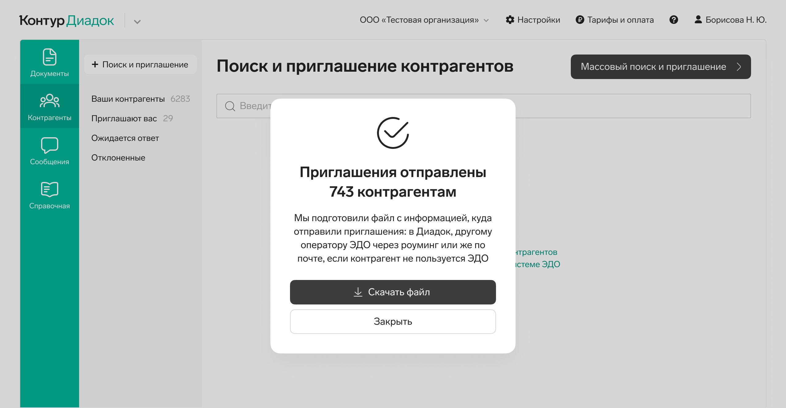

На ЮТ пользователи без труда находили кнопку массового приглашения, и дальше хорошо справлялись со сценарием. Отдельно радовались возможности скачать файлы на разных шагах.

Сейчас задача ждет разработки.